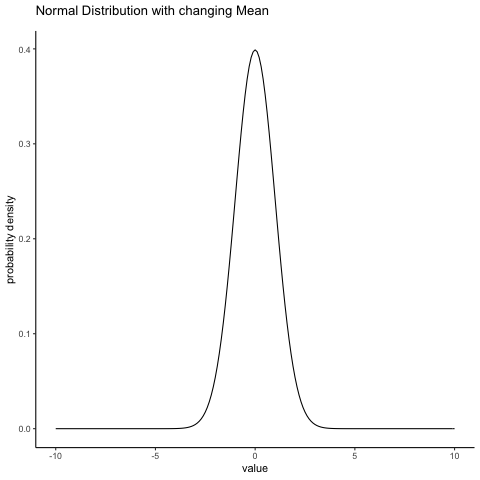

```{r setup, include = FALSE, warning = FALSE, message = FALSE}
knitr::opts_chunk$set(echo = FALSE, message = FALSE, warning = FALSE)
library(ggplot2)
library(xaringanExtra)
```


## Objetivos

- Por que a Teoria da Probabilidade é importante em Finanças? 

- Breve digressão sobre Teoria da Probabilidade
   
- Distribuição Normal 

- Aplicação: Simulação de Monte Carlo

- Aplicação: Valor-em-Risco


## Referência

Brooks (2019): Chapter 2 - Statistical Foundations and Dealing with Data


## Por que a Teoria da Probabilidade é importante em Finanças?

- Fenômenos **Determinísticos** 

- Fenômenos **Aleatórios** (ou Estocásticos)

- Necessidade de Modelos Probabiísticos

    - Com o advento da revolução dos dados, as organizações estão se tornando 
      progressivamente mais sofisticadas no uso de modelos quantitativos, sejam  
      estatísticos, econométricos ou baseados em aprendizagem. 

    - As implementações iniciais desses modelos eram **descritivas**, usando 
      apenas estatísticas para descrever o que acontecia, enquanto as 
      implementações posteriores eram mais **diagnósticas** e focadas na 
      compreensão dos mecanismos causais subjacentes ao que aconteceu. 

     - Mas as organizações eralmente precisam de mais do que esse entendimento: 
       elas também precisam ser capazes de construir modelos que sejam 
       **preditivos** e prever as possíveis consequências futuras de diferentes 
       cursos de ação. 

     - Por fim, precisam ainda que seus modelos sejam **prescritivos** - isto é, 
       que os meodelos forneçam informações para ajudá-los a selecionar entre   
       possíveis cursos de ações, com base nos objetivos da organização.

     - Assim, o objetivo final de qualquer curso de análise quantitativa deve ser        ensinar aos alunos **a arte de construir modelos quantitativos que possam 
       fornecer insights práticos sobre problemas reais de decisão**. 


## Por que a Teoria da Probabilidade é importante em Finanças?

- *Value-at_Risk* (VaR) = Valor-em-Risco

- Até 1994, a única medida de risco era a volatilidade, que é simplesmente o **desvio-padrão** dos retornos.

- Nesta época, o banco JP Morgan propôs uma medida de risco chamada 
  *Value-at-Risk (VaR)* e um método para medi-lo, chamado [*Riskmetrics*](https://www.msci.com/documents/10199/5915b101-4206-4ba0-aee2-3449d5c7e95a).

- Por que o JP Morgan faria isso? para poder reduzir seu nível de capital.

- Costumava ser chamado de relatório $4^{15}$ pois foi criado porque o 
  presidente do banco queria uma medida única do risco do banco a tempo da  
  reunião da tesouraria às 16:15 horas.
  
- [Deloitte: In Defence of VaR](https://www2.deloitte.com/content/dam/Deloitte/uk/Documents/risk/deloitte-uk-risk-in-defence-of-var.pdf)


## Comitê de Supervisão Bancária da Basiléia

- [The Basel Committee on Banking Supervision (BCBS)](https://www.bis.org/bcbs/)

- O Comitê de Supervisão Bancária da Basileia (BCBS) é o principal definidor 
de padrões globais para a regulação prudencial dos bancosm, sendo um fórum para cooperação regular em questões de supervisão bancária. 

- Seus 45 membros compreendem bancos centrais e supervisores bancários de 28 jurisdições.


- Acordo de Basiléia I (1988)

    - Estabelecimento de padrões mínimos de capital para bancos
    - Capital próprio como base de cálculo
    - Risco ponderado por tipo de ativo
    - 8% de capital mínimo


- Acordo de Basiléia II (2004)

    - Valor-em-Risco foi introduzido neste acordo
    - Reforço na análise de riscos, com maior complexidade
    - Introdução de três abordagens para cálculo de capital regulatório
    - Melhoria na supervisão e transparência


- Crise Financeira de 2008

    - Revelação de fragilidades do acordo de Basiléia II
    - Necessidade de revisão das regras


- Acordo de Basiléia III (2010)

    - Aumento do capital mínimo para 10,5%
    - Novas exigências de liquidez
    - Ampliação da definição de capital regulatório
    - Controle de risco de mercado, de crédito e operacional
    - Estabelecimento de um colchão de conservação de capital


- Revisão de Basiléia III (2017)

    - Aperfeiçoamentos nas medidas de risco de crédito e operacional
    - Simplificação de regras para bancos menores e menos complexos
    - Introdução de padrões mínimos para exposição a risco de crédito de 
      contrapartes   centrais de compensação (CCP)
    - Fortalecimento da supervisão
    - O Acordo de Basiléia III é a base para a supervisão bancária em todo o 
      mundo.


## Aplicações: Teoria da Probabilidade 

```{r art1, out.width = "50%", echo = FALSE, fig.align = 'center'}

```

[Parametric Methods for Estimating the Level of Risk in Finance](https://www.sciencedirect.com/science/article/pii/S2212567115006723)


## Aplicações: Teoria da Probabilidade


```{r art2, out.width = "50%", echo = FALSE, fig.align = 'center'}

```

[Estimação da probabilidade de negociação privilegiada por meio de inferência bayesiana](https://repositorio.unb.br/handle/10482/23138)


## Breve digressão sobre Teoria da Probabilidade

**Conceito de Probabilidade**

- Probabiliade Clássica ou a priori:

Se $N$ é o número total de casos do espaço amostral de uma variável aleatória 
e $n_A$ é o número de casos com resultado $A$, a probabilidade clássica ou 
a priori de A é dada por:

$$
P(A) = \frac{n_A}{N}
$$

- Probabilidade Frequentista

Se $m$ é o número de ocorrências do evento $A$ em um total de $M$ tentativas, a probabilidade de $A$ é dada por:

$$
P(A) = \lim_{M \rightarrow \infty} \frac{m}{M}
$$
O limite que aparece nesta definição tem um significado experimental e não matemático, porque a verdadeira probabilidade deve ser encontrada apenas pela realização de um número infinito de tentativas.


- Probabilidade Subjetiva

A probabilidade é o grau subjetivo de crença sobre a ocorrência de um evento.

A probabilidade subjetiva é relativamente livre, mas assume-se que deve ser *consistente*, ou seja, deve ser expressa como um número real $0 \leq p \leq 1$.


- **Probabilidade Axiomática**

    - Axioma 1: $P(A) \geq 0$ para todo evento $A$.
		
    - Axioma 2: $P(S) = 1$, sendo $S$ = Espaço Amostral.
		
    - Axioma 3: Se todos os eventos $A_i$ são mutuamente exclusivos:
		
	   $$
	   P(A_1 \cup A_2 \cup \ldots A_k) = \sum_{i=1}^k P(A_i)
	   $$


- **Probabilidade Condicional**

Definição: Para quaisquer dois eventos $A$ e $B$, com $P(B>0)$: 

$P(A|B) = \frac{P(A \cap B)}{P(B)}$

- Regra da Multiplição

$P(A \cap B) = P(A|B) P(B)$


- **Eventos independentes**

    -Dois eventos $A$ e $B$ são independentes se $P(A|B) = P(A)$ e dependentes, 
     caso contrário.

- Proposição

$A$ e $B$ são independentes se, e somente se: 

$$
P(A \cap B) = P(A)P(B)
$$


- **Independência de mais de dois eventos**

    - Os eventos $A_1,\ldots,A_n$ são mutuamente independentes se para cada $k$ 
      $(k=2,3,\ldots,n)$ e cada subconjunto de índices $i_1,i_2,\ldots,i_k$:

     $$
     P(A_{i_1} \cap A_{i_2} \cap \ldots \cap A_{i_k}) = P(A_{i_1})\cdot    
     P(A_{i_2})\ldots P(A_{i_k}) 
     $$


- **Variável Aleatória**

Seja $S$ o espaço amostral de um processo aleatório, **variável aleatária** é qualquer **função** que associa um número a um resultado em $S$, cujo domínio 
é o espaço amostral e a imagem são números. 

- **Discretas:** os valores possíveis são **contáveis**. Ex: Número de empresas que fazem uso de técnicas de orçamento de capital.

- **Contínuas:** infinitos (pelo menos teoricamente) e incontáveis valores possíveis. Ex: Medidas (Peso, massa, preço, retorno, taxa de juros etc.)


- **Variável Aleatória Discreta**

A funçao de probabilidade de uma VA discreta X é a  função $f: \mathbb{R} \rightarrow [0,1]$ definda por:

$$
p(X = x) = p(x) 
$$

Condições:

$$
\begin{align*}
p(x) &\geq 0, \\
\sum p(x) &= 1
\end{align*}
$$

estas condições implicam que $0 \leq p(x) \leq 1$

```{r, echo = FALSE, fig.align='center'}
barplot(height = dbinom(0:10, size = 10, p = 0.7), 
        names.arg = 0:10,
        main = "fp de Dist. Binomial", xlab = 'X', ylab = 'Prob.', 
        ylim = c(0,1))
```


- **Variável Aleatória Contínua**

A função densidade de probabilidade de uma VA contínua X é a função $f: \mathbb{R} \rightarrow \mathbb{R}$ definda por:
$$
\begin{equation*}
p(a \leq X \leq b) = \int_{a}^{b} f(x)dx
\end{equation*}	
$$

Condições:

$$
\begin{align*}
f(x) &\geq 0, \\
\int_{-\infty}^{+\infty} f(x) &= 1
\end{align*}
$$


```{r fig0, out.width = "60%", echo = FALSE, fig.align = 'center'}

```

- **Função de Distribuição de Probabilidades Acumulada**

A função de distribuição acumulada $F(\cdot)$ de uma VA $X$ é a função $F:\mathbb{R} \rightarrow [0,1]$ definida por:

$$
F(a) = P(X \leq a)\,\,\, \text{para} \,\, -\infty \leq a \leq \infty
$$
```{r fig01, out.width = "30%", echo = FALSE, fig.align = 'center'}

```


## Características de Variáveis Aleatórias

**Valor Esperado de uma VA Discreta**:

$$
E(Y) = \sum_{y \in \mathbb{D}} y P(Y = y)
$$

Exemplo: 

```{r, echo = TRUE, eval = FALSE}
valor_rifa <- 10
premio <- 10000
bilhetes <- 25000
prpb_ganhar <- 1/bilhetes

valor_esperado_rifa <- function(premio, bilhetes) {
    prob_ganhar <- 1/bilhetes
    ve <- cumprod(premio*prob_ganhar)
    ve
}

# bilhetes = 2500 bilhetes vendidos
valor_esperado_rifa(10000, 2500)

# bilhetes = 1000
valor_esperado_rifa(10000, 1000)
```


**Valor Esperado de uma VA Contínua**:

$$
E(Y) = \mu = \int_{-\infty}^{+\infty} yf(y)dy
$$

**Valor Esperado Condicional** de uma VA Discreta:

$$
E(Y|X = x) = \sum_{y \in \mathbb{D}} y P(Y = y|X = x)
$$

**Varância** de uma VA

$$
\begin{align*}
V(Y) &= \sigma^2 = E[(Y - E(Y))^2]
\end{align*}
$$

O **Desvio-Padrão** é: $\sigma = \sqrt{V(Y)}$	


**Quantis**

Seja $Y$ uma VA e $p$ um número entre $[0,1]$. O $p-$ésimo  quantil (ou 
100-ésimo percentil) da distribuição de $X$, é o menor número $q_p$ tal que:

$$
F(q_p) = P(Y \leq q_p) = p
$$

A mediana de uma distribuição, equivale ao 50-ésimo percentil e ao segundo 
quartil.

```{r fig02, out.width = "30%", echo = FALSE, fig.align = 'center'}
knitr::include_graphics("img/quantil.png")
```


## Coeficientes de Assimetrria Assimetria e Curtose

```{r xaringan-panelset1, echo=FALSE}
xaringanExtra::use_panelset()
```

::::: {.panelset}

::: {.panel}

[Assimetria e Curtose]{.panel-name}

$$
Assi(X) = E\left[\left(\frac{X - \mu}{\sigma}\right)^3\right]
$$

$$
Cur(X) = E\left[\left(\frac{X - \mu}{\sigma}\right)^4\right]
$$
:::

::: {.panel}

[Visualização]{.panel-name}

```{r ac, out.width = "45%", echo = FALSE, fig.align = 'center'}
knitr::include_graphics("img/ac.png")
```

:::

::::


## Covariância e Correlação

- Covariância:

$$
\begin{align*}	
Cov(X,Y) = \sigma_{XY} &= E[(X - \mu_X)(Y - \mu_Y)], \\
         &= E[XY] - \mu_X \mu_Y
\end{align*}
$$

- Correlação:

$$
\begin{equation*}	
Cor(X,Y) = \rho_{xy} = \frac{Cov(X,Y)}{\sigma_X \sigma_Y} \,\, (-1 \leq \rho_{xy} \leq +1)
\end{equation*}
$$


- Coeficiente de Correlação de Pearson

$$
{\displaystyle r_{xy} = {\frac {\sum _{i=1}^{n}(x_{i}-{\bar {x}})(y_{i}-{\bar {y}})}{{\sqrt {\sum _{i=1}^{n}(x_{i}-{\bar {x}})^{2}}}{\sqrt {\sum _{i=1}^{n}(y_{i}-{\bar {y}})^{2}}}}}}
$$

- $r_{xy}$ é um de diversos possíveis estimadores de $\rho_{xy}$. 

- Uma das competências dos estatísticos/econometristas é desenvolver 
  **estimadores** para **parâmetros** populacionais.
  
  
## Características de Variáveis Aleatórias Multidimensionais

No caso de uma VA multidimensional $X$ representado por um **vetor aleatório** 
$\mathbf{X}$,

$$
\begin{equation}
\mathbf{X} =
\begin{pmatrix}
  X_1 \\
  X_2 \\
  \vdots \\
  X_n 
\end{pmatrix}
\end{equation}
$$

Os dois principais parâmetros que caracterizam a distribuição são o **vetor de valores esperados**:


$$
\begin{equation}
E[\mathbf{X}] =
\begin{pmatrix}
  E(X_1) \\
  E(X_2) \\
  \vdots \\
  E(X_n) 
\end{pmatrix}
\end{equation}
$$

E a  **Matriz de Covariâncias**:

$$
\begin{equation}
Cov(\mathbf{X}) =
\begin{pmatrix}
  \sigma_{11} & \sigma_{12} & \ldots & \sigma_{1n} \\ 
  \sigma_{21} & \sigma_{22} & \ldots & \sigma_{2n} \\ 
  \vdots      & \vdots      & \vdots & \vdots      \\
  \sigma_{n1} & \sigma_{n2} & \ldots & \sigma_{nn}
\end{pmatrix}
\end{equation}
$$

$$
Cov(\mathbf{X}) = E[(\mathbf{X} - E(\mathbf{X})) (\mathbf{X} - E(\mathbf{X}))^T]
$$

Sendo $\sigma_{j}^2 = V(\mathbf{X}_{j})$ e $\sigma_{jk} = Cov(\mathbf{X}_{j}, \mathbf{X}_{k})$ para $j, k = 1, 2, \ldots, n$.


## Distribuição de Probabilidades de Variáveis Aleatórias

Por que conhecer Distribuições de Probabilidade?

- Você pode tentar descobrir a distribuição que corresponde ao
processo gerador dos dados (PGD) da variável dependente.

- Com uma distribuição de probabilidades adequada, podemos simular o 
processo ou fenômeno de interesse.
	
- Você pode ajustar distribuições a uma variedade de dados!
	
- Você pode construir um bom modelo estatístico para inferência preditiva 
  ou descritiva.  

O que temos de saber sobre distribuições de probabilidade para aplicá-las 
em um problema particular?

- Você tem que saber as "histórias" por trás delas.

- Você deve escolher uma distribuição que corresponde ao processo 
gerador de dados sua variável dependente.

- Você tem que entender as hipóteses que você faz ao
escolher uma distribuição.  


## Distribuição Normal: Visão Geral

**Aplicação:** Qualquer fenômeno que tenha como resultado um número real.
Modela dados que aglomeram-se em uma curva em forma de sino em torno da média.
O Teorema Central do Limite é uma forte justificativa para sua popularidade.
Ex: Modelagem da Duração da Chuva.


- Teorema Central do Limite

Seja $X_1,\ldots,X_n$ uma sequência de variáveis aleatórias independentes com 
distribuição de probabilidade arbitrária com média $\mu_i$ e variância finita $\sigma_{i}^2$. Então:

$$
\frac{\bar{X} - \mu}{\sigma/\sqrt{n}} \overset{d}{\to} N(0,1) \,\,(n \rightarrow \infty)
$$

Vamos simular um experimento 2.000 vezes, extraindo amostras (pseudo-)aleatórias 
de uma distribuição Binomial com probabilidade de sucesso igual 0.05 e quatro 
tamanhos de amostras: 20, 100, 500 e 1.000. Para cada tamanho de amotra, 
estimamos a média e o score $Z$

```{r tcl, out.width = "90%", echo = FALSE, fig.align = 'center'}

```


**Definição**: Uma VA contínua $X$ tem distribuição normal ($X \sim N(\mu, \sigma^2)$) se:

$$
f(x) = \frac{1}{\sigma\sqrt{2\pi}} e^{-\frac{1}{2}\Bigl(\frac{x-\mu}{\sigma}\Bigr)^2} \,\, (-\infty < x < \infty)
$$

Distribuição normal padronizada: 

$Z = \frac{x - \mu}{\sigma} \sim N(\mu = 0, \sigma = 1)$

$$
\phi(z) = \frac{1}{\sigma\sqrt{2\pi}} e^{-\frac{1}{2}z^2} 
$$

$$
E(X) = \mu \,\,\,\, V(X) = \sigma^2 \,\,\,\, \sigma = \sqrt{\sigma^2}
$$

Como simular no R? `rnorm(1000)`

$f_{\mu, \sigma}(x) = \phi_{\mu, \sigma}(x)$ = Função Densidade de Probabilidade

```{r distsn, out.width = "60%", echo = FALSE, fig.align = 'center'}
knitr::include_graphics("img/normais.png")
```

$F_{\mu, \sigma}(X) = \Phi_{\mu, \sigma}(x)= P(X \leq x)$ = Função de Distribuição Acumulada

```{r nac, out.width = "60%", echo = FALSE, fig.align = 'center'}

```


- Distribuição Normal Padronizada (ou Padrão): 

$Z = \frac{x - \mu}{\sigma} \sim N(\mu = 0, \sigma = 1)$

```{r npadrao, out.width = "55%", echo = FALSE, fig.align = 'center'}

```

- Efeito de Alterar $E(X) = \mu$:




- Efeito de Alterar $\sigma$


- Distribuição Normal Bivariada


```{r nbiv, out.width = "55%", echo = FALSE, fig.align = 'center'}
knitr::include_graphics("img/normm.jpg")
```

```{r fbiv, out.width = "40%", echo = FALSE, fig.align = 'center'}

```


- A Distribuição Normal em R

Função                                          Resultado,
----------------------                          ----------------------------------
`dnorm(x, mean = 0, sd = 1)`                    $f(x)= x$ densidade
`pnorm(q, mean = 0, sd = 1, lower.tail = TRUE)` $F(a) = P(X \leq a)$
`qnorm(p, mean = 0, sd = 1, lower.tail = TRUE)`  quantil = $\Phi^{-1}(p)$
`rnorm(n, m=0, sd=1)`                           sgerador de números aleatórios

```{r}

```


[Distribuições de Probabilidade no R](https://en.wikibooks.org/wiki/R_Programming/Probability_Distributions)


`pnorm(0)` = $F(0) = P(Z \leq 0)$


```{r g1}
# Prep the distribution data
x <- seq(-3, 3, 0.005)
y <- pnorm(x)
normal <- as.data.frame(cbind(x,y))

x2 <- c(x[1:600], rep(0,601))
y2 <- c(y[1:600], rep(0,601))
p <- ggplot(mapping = aes(x, y), data = normal) +
     geom_line(size = 1.3) +
     geom_vline(xintercept = 0, color = "blue", size = 1.3, linetype = 2) +
     scale_x_continuous(n.breaks = 7) +
     labs(title = "pnorm(0)", x = NULL, y = NULL, 
          subtitle = "P é para Probabilidade") +
     geom_area(inherit.aes = F, mapping = aes(x=x2, y=y2), fill = "tomato", 
               alpha = 0.2) +
     annotate(geom = "rect", xmin = -2.6, xmax = -2, ymin = 0.12, ymax = 0.18,
              alpha = 1, fill = "white", color = "black") +
     annotate(geom = "text", label = "0.50", x = -2.3, y = 0.15, size = 6) +
     annotate(geom = "segment", x = -2.7, xend = 0, y = 0.01, yend = 0.01, 
              size = 1.1, arrow = arrow(length = unit(3, "mm"))) +
     theme_classic(base_size = 14, base_family = "Courier") +
     theme(plot.title = element_text(size = 24, face = "bold", hjust = 0.5)) +
     theme(plot.subtitle = element_text(face = "italic", hjust = 0.5))
p
```

`pnorm(0, lower.tail = FALSE)` = 1 - `pnorm(0)` = $P(Z > 0)$

```{r}
# Prep the distribution data
x9 <- c(rep(0,600), x[601:1201])
y9 <- c(rep(0,600), y[601:1201])

p1 <- ggplot(mapping = aes(x, y), data = normal) +
     geom_line(size = 1.3) +
     geom_vline(xintercept = 0, color = "blue", size = 1.3, linetype = 2) +
     scale_x_continuous(n.breaks = 7) +
     labs(title = "1-pnorm(0)", x = NULL, y = NULL, 
          subtitle = "P é para Probabilidade") +
     geom_area(inherit.aes = F, mapping = aes(x=x9, y=y9), fill = "tomato", 
               alpha = 0.2) +
     annotate(geom = "rect", xmin = 2.6, xmax = 2, ymin = 0.12, ymax = 0.18,
              alpha = 1, fill = "white", color = "black") +
     annotate(geom = "text", label = "0.50", x = 2.3, y = 0.15, size = 6) +
     annotate(geom = "segment", x = 2.7, xend = 0, y = 0.01, yend = 0.01, 
              size = 1.1, arrow = arrow(length = unit(3, "mm"))) +
     theme_classic(base_size = 14, base_family = "Courier") +
     theme(plot.title = element_text(size = 24, face = "bold", hjust = 0.5)) +
     theme(plot.subtitle = element_text(face = "italic", hjust = 0.5))
p1
```

`pnorm(1)` = $F(0) = P(Z \leq 1)$

```{r}
x3 <- c(x[1:801], rep(1,400))
y3 <- c(y[1:801], rep(0,400))

p2 <- ggplot(mapping = aes(x, y), data = normal) +
     geom_line(size = 1.3) +
     geom_vline(xintercept = 1, color = "blue", size = 1.3, linetype = 2) +
     scale_x_continuous(n.breaks = 7) +
     labs(title = "pnorm(1)", subtitle = "P é para probabilidade", 
          x = NULL, y = NULL) +
     geom_area(inherit.aes = F, mapping = aes(x=x3, y=y3), fill = "tomato", 
               alpha = 0.2) +
     annotate(geom = "rect", xmin = -2.6, xmax = -2, ymin = 0.12, ymax = 0.18,
              alpha = 1, fill = "white", color = "black") +
     annotate(geom = "text", label = "0.84", x = -2.3, y = 0.15, size = 6) +
     annotate(geom = "segment", x = -2.7, xend = 1, y = 0.01, yend = 0.01, 
              size = 1.1, arrow = arrow(length = unit(3, "mm"))) +
     theme_classic(base_size = 14, base_family = "Courier") +
     theme(plot.title = element_text(size = 24, face = "bold", hjust = 0.5)) +
     theme(plot.subtitle = element_text(face = "italic", hjust = 0.5))
p2
```

Caso comum

$P(a \leq Z \leq b) = P(Z \leq b) - P(Z \leq a) = F(b) - F(a)$

`dnorm(0)` = $f(0)= 0.4$

```{r}
x <- seq(-3, 3, 0.005)
y <- dnorm(x)
normal <- as.data.frame(cbind(x,y))

d1 <- ggplot(mapping = aes(x, y), data = normal) +
     geom_line(size = 1.3) +
     geom_vline(xintercept = 0, color = "blue", size = 1.3, linetype = 2) +
     scale_x_continuous(n.breaks = 7) +
     labs(title = "dnorm(0)", subtitle = "D é para Densidade", 
          x = NULL, y = NULL) +
     annotate(geom = "rect", xmin = -3, xmax = -2.4, ymin = 0.33, ymax = 0.39,
              alpha = 1, fill = "white", color = "black") +
     annotate(geom = "text", label = "0.40", x = -2.7, y = 0.36, size = 6) +
     annotate(geom = "segment", y = 0.4, yend = 0.4, x = -3, xend = 0, 
              color = "tomato", size = 1.25, linetype = 6) +
     theme_classic(base_size = 14, base_family = "Courier") +
     theme(plot.title = element_text(size = 24, face = "bold", hjust = 0.5)) +
     theme(plot.subtitle = element_text(face = "italic", hjust = 0.5))
d1
```


`qnorm(0.5)` = $\Phi^{-1}(0.5) = Z = 0$ 

```{r}
# Prep the distribution data
x <- seq(-3, 3, 0.005)
y <- pnorm(x)
normal <- as.data.frame(cbind(x,y))

q1 <- ggplot(mapping = aes(x, y), data = normal) +
     geom_line(size = 1.3) +
     geom_vline(xintercept = 0, color = "blue", size = 1.3, linetype = 2) +
     scale_x_continuous(n.breaks = 7) +
     labs(title = "qnorm(0.5)", x = NULL, y = NULL, 
          subtitle = "Q é para Quantil") +
     geom_area(inherit.aes = F, mapping = aes(x=x2, y=y2), fill = "tomato", 
               alpha = 0.2) +
     annotate(geom = "rect", xmin = -0.25, xmax = 0.25, ymin = 0.03, ymax = 0.09,
              alpha = 1, fill = "white", color = "black") +
     annotate(geom = "text", label = "0", x = 0, y = 0.06, size = 6) +
     annotate(geom = "segment", x = -2.7, xend = 0, y = 0.01, yend = 0.01, 
              size = 1.1, arrow = arrow(length = unit(3, "mm"))) +
     annotate(geom = "text", label = "50%", x = -1.25, y = 0.055, size = 4) +
     theme_classic(base_size = 14, base_family = "Courier") +
     theme(plot.title = element_text(size = 24, face = "bold", hjust = 0.5)) +
     theme(plot.subtitle = element_text(face = "italic", hjust = 0.5))
q1
```

`qnorm(0.9)` = $\Phi^{-1}(0.9) = Z = 1.28$ 

```{r}
x8 <- c(x[1:856], rep(1.28,345))
y8 <- c(y[1:856], rep(0,345))

q5 <- ggplot(mapping = aes(x, y), data = normal) +
     geom_line(size = 1.3) +
     geom_vline(xintercept = 1.28, color = "blue", size = 1.3, linetype = 2) +
     scale_x_continuous(n.breaks = 7) +
     labs(title = "qnorm(0.9)", x = NULL, y = NULL, 
          subtitle = "Q é para Quantil") +
     geom_area(inherit.aes = F, mapping = aes(x=x8, y=y8), fill = "tomato", 
               alpha = 0.2) +
     annotate(geom = "rect", xmin = -0.3, xmax = 0.3, ymin = 0.03, ymax = 0.09,
              alpha = 1, fill = "white", color = "black") +
     annotate(geom = "text", label = "1.28", x = 0, y = 0.06, size = 5) +
     annotate(geom = "segment", x = -2.7, xend = 1.28, y = 0.01, yend = 0.01, 
              size = 1.1, arrow = arrow(length = unit(3, "mm"))) +
     annotate(geom = "text", label = "90%", x = 0.8, y = 0.25, 
              size = 4) +
     theme_classic(base_size = 14, base_family = "Courier") +
     theme(plot.title = element_text(size = 24, face = "bold", hjust = 0.5)) +
     theme(plot.subtitle = element_text(face = "italic", hjust = 0.5))
q5
```


## Distribuição Normal: Exercícios 1

Quais características uma distribuição de probabilidade normal deve possuir 
para ser uma distribuição normal padrão? 

Sendo $Z = \frac{X - \mu}{\sigma} \sim N(\mu = 0, \sigma = 1)$ Determine as 
seguintes probabilidades normais padrão:

$P(Z \leq 1.25)$

$P(Z > 1.25)$

$P(Z \leq -1.25)$

$P(-0.38 \leq Z \leq 1.25)$ 


## Distribuição Normal: Exercícios 2 {.smaller}

Encontre o z-score correspondente à probabilidade (área) sob cada curva normal 
padrão: 

```{r ex2, out.width = "30%", echo = FALSE, fig.align = 'center'}

```


## Aplicações: Métodos de Monte Carlo

Em termos bastante gerais, seria aualquer método que resolve um problema 
através da geração de números (pseudo)aleatórios adequados.
	
Esses métodos são úteis para a obtenção de soluções numéricas para problemas 
que são muito complexos para serem resolvidos analiticamente. Podemos estar interessados em simular um fenômeno aleatório ou verificar como o comportamento de um fenômeno é alterado quando alteramos determinados parâmetros.

- Métodos de Monte Carlo são usadas extensivamente em estatística, física, engenharia, economia, admnistração e em muitas outras áreas. 

- O nome foi cunhado na década de 1940 pelos matemáticos Stanislaw Ulam e John von Neumann e enquanto trabalhavamo no Projeto Manhattan. Recebeu o nome do famoso cassino de Monte Carlo, em Mônaco.

- Uma simulação de Monte Carlo é baseada no modelo de frequência relativa
para probabilidades: Dado um experimento aleatório e algum evento $A$, a probabilidade $P(A)$ é estimada repetindo-se o experimento aleatório muitas 
vezes e calculando-se a proporção de vezes que $A$ ocorre.

- Seja $X_1, X_2,\ldots$ uma sequência de VAs com:

$$
X_k = 
\begin{cases}
1, & \text{se A ocorre na k-ésima repetição} \\
0, & \text{se A não ocorre na k-ésima repetição}
\end{cases}
$$
para $k = 1, 2,\ldots$, então: 

$$
\frac{X_1 + X_2 + \ldots + X_n}{n}
$$
é a proporção de vezes em que $A$ ocorre em $n$ repetições. Para n grande, o Monte Carlo método estima $P(A)$ por: 

$$
P(A) \approx \frac{X_1 + X_2 + \ldots + X_n}{n}
$$

- Simulação de Monte Carlo 

A implementação de uma simulação de Monte Carlo de P(A) requer três etapas:

1. **Simule uma repetição**: modele ou traduza o experimento aleatório usando números aleatórios no computador. Uma iteração do experimento é chamada de “teste”.

2. **Determine o sucesso**: Com base no resultado da repetição, determine se o evento $A$ ocorre ou não. Se sim, chame isso de "*sucesso*".

3. **Replicação**: Repita as duas etapas mencionadas várias vezes.


- Exemplo: 

Vejamos um exemplo inicial muito simples, até mesmo trivial.

Considere simular a probabilidade de que uma moeda honesta resulte "cara" em 
$n$ lançamentos. Pode-se fazer uma simulação física apenas jogando uma moeda várias vezes e tomando a proporção de caras para estimar $P(Caras)$.

Usando um computador, escolha o número de tentativas n (quanto maior, melhor) e utilize o seguinte comando R:

```{r, eval=FALSE, echo=TRUE}
sample(0:1, n, replace = T)
```

O comando faz uma amostragem com reposição de ${0, 1}$, $n$ vezes de forma que os resultados sejam igualmente prováveis. 

Considerando que $0$ representa coroa e 1 representa cara, a saída é uma sequência de $n$ uns e zeros correspondentes a caras e coroas. 

A média da sequência é precisamente a proporção de uns. Para simular $P(Cara)$ fazemos:

```{r, eval = FALSE, echo=TRUE}
mean(sample(0:1, 10, replace = T))
mean(sample(0:1, 100, replace = T))
mean(sample(0:1, 1000, replace = T))
mean(sample(0:1, 10000, replace = T))
mean(sample(0:1, 100000, replace = T))
mean(sample(0:1, 1000000, replace = T))
```

No notebook da aula, vejamos como estimar por simulação uma probabilidade 
familiar: a probabilidade e obter três caras em três lançamentos de uma 
moeda.

- Integração de Monte Carlo

Seja, 

$$	
\int_{0}^{1} f(x)dx
$$

uma função real limitada e seja $E(f(U))$ uma função de interesse, sendo $U$ uma 
VA com distribuição uniforme no intervalo $[0,1]$. 

Pela lei dos grandes n?meros, se $(U_i, i\geq 1)$ é uma família de VAs uniformemente distribuídas em $[0,1]$, então:

$$
S_{N} = \frac{1}{N}\sum_{i=1}^{N} f(U_i) \rightarrow \int_{0}^{1} f(x)dx = E(f(U))
$$ 	

Estes fatos sugerem um algoritmo muito simples para aproximar $E(f(U))$: 

1. Utilize um gerador de números (pseudo)aleatórios para produzir $N$ valores.

2. Calcule a média dos resultados.

Suponha que desejamos resolver a seguinte integral:

$$
\int_{0}^{1} \frac{\sin{(x(1-x))}}{(1+x+\sqrt{x}))}
$$
Vejamos no notebook da aula, como estimar essa integral por simulação de Monte 
Carlo.


## Aplicação: Análise de Insolvência via Simulação de Monte Carlo

O FI – Fator de Insolvência de Kanitz – é obtido por meio da seguinte fórmula:

$$
FI = 0,05A + 1,65B + 3,55C – 1,06D – 0,33E
$$
sendo:

$A =$ Rentabilidade do Patrimônio Líquido: lucro líquido/patrimônio líquido;

$B =$ Liquidez Corrente: ativo circulante (+) realizável a longo prazo/exigível total;

$C =$ Liquidez Seca: ativo circulante (–) estoques/passivo circulante;

$D =$ Liquidez Corrente: ativo circulante/passivo circulante;

$E =$ Grau de Endividamento: passivo total/patrimônio líquido.

Termômetro de Kanitz:

- $FI > 0$: Empresa está em uma situação estável ou solvente

- $-3 \leq FI \leq 0$: “Penumbra” representa uma região em que o fator de insolvência não é suficiente para analisar o estado da empresa, mas inspira cuidados.

- $FI < -3$: Empresa encontra-se em uma situação ruim ou “insolvente” e que poderá́ levá-lá à falência.

Vejamos como realizar uma análise de insovência usando o FI de Kanitz e a 
simulação de Monte Carlo no notebook da aula.


## Aplicações: Value-at_Risk (VaR)

**Definição**: *o VaR é a perda em uma carteira tal que existe uma probabilidade* $p$ *de perdas iguais ou superiores ao VaR em um determinado período de negociação e uma probabilidade* $(1-p)$ *de perdas serem inferiores ao VaR*. 

- $VaR$ é a medida mais comum de risco depois da volatilidade.

- Podemos escrever $VaR(p)$ ou $VaR^(100*p\%)$ para tornar a dependência do 
  $VaR$ em relação à probabilidade ($p$) explícita. Os níveis mais comuns de 
  probabilidade são 1% e 5% ($VaR(0.05)$ ou $VaR^{5\%}$).
  
- $VaR$ é um **quantil** da distribuição de lucros e perdas ($P/L$).


## Value-at_Risk (VaR)

- O **nível de significância ou de confiança** do VaR, ou seja, 
a probabilidade que está associada a uma medida do VaR ($p$), corresponde à frequência com que se espera que um determinado nível de perda ocorra.

- Assim, um VaR de 1-dia com $p = 0.05 = 5\%$ corresponde a um nível de perda 
que se espera exceder, em circunstâncias normais de mercado, um dia em 20.

- E um VaR de 1-dia com $p = 0.01 = 1\%$ é o nível de perda que pode ser 
esperado um dia em 100. 

**Definição**: O VaR de h-dias com $100p\%$ é um número $VaR_{p,h}$ tal que a 
probabilidade de perder $VaR_{p,h}$ ou mais, nos próximos h-dias, é igual 
$100p\%$.


## Value-at_Risk (VaR): Método Paramétrico (distribuição normal)

**Exemplo**: 

- Suponha que $\vartheta = 1$ e $\sigma = 1$, considerando que 
os retornos são normalmente distribuídos aproximadamente;

- Se $p = 0.05$, temos: $VaR = - \Phi^{-1}(0.05) = 1.64$

- Se $\sigma \neq 1$, temos: $VaR^{5\%} = \sigma (1.64)$

- Se $\sigma \neq 1$ e $\vartheta \neq 1$, temos: $VaR^{5\%} = \sigma(1.64)\vartheta$


## Value-at_Risk (VaR)

- Se indicamos os lucros e perdas ($P/L$) de uma carteira de investimentos 
pela variável aleatória $Q$, com uma realização particular denotada por $q$. 

- Se temos uma unidade de um ativo, e $\vartheta$ representa o valor de 
uma carteira, $Q$ pode ser representado por:

$$
Q = \vartheta \Bigl(\frac{P_t - P_{t-1}}{P_{t-1}}\Bigr)
$$


- Isto é, $Q$ é o valor da carteira multiplicado pelos retornos. Se, a função 
densidade de $Q$ é denotada por $f_q(\cdot)$, o $VaR$ é então dado por:

$$
P[Q \leq -VaR(p)] = p = \int_{-\infty}^{-VaR(p)} f_q(x)dx
$$

## Derivando o VaR

$$
\begin{align*}
 p &= P[Q \leq -VaR(p)], \\
   &= P(P_t - P_{t-1} \leq -VaR(p)), \\
   &= P(P_{t-1} R_t \leq -VaR(p)), \\
   &= (\frac{R_t}{\sigma} \leq - \frac{VaR(p)}{P_{t-1}\sigma})
\end{align*}
$$

Se denotamos a distribuição padronizada dos retornos por $F_R(\cdot)$ e 
a distribuição inversa por $F_{R}^{-1}(\cdot)$, então:

$$
\begin{align*}
VaR(p) &= -\sigma F_{R}^{-1}(p) P_{t-1}, \\
       &= -\sigma F_{R}^{-1}(p) \vartheta
\end{align*}
$$

## Métodos para obtenção de estimativas do VaR

- O foco deste seção são técnicas para a implementação de previsões de
 risco (VaR), especificamente:
 
    - Método Histórico (ou de Simulação Histórica) 
    - Métodos Paramétricos (assumindo distribuição normal)
    
- Simulação Histórica: é um **método não-paramétrico** para a estimação 
do Risco (VaR), isto é, não assumimos que os dados (retornos) seguem uma 
distribuição de probabilidade, portanto, não há parâmetros a serem 
estimados.

- VaR com retornos $\sim N(\mu = 0,\sigma = 1)$: é um **método paramétrico**, 
pois assumimos que os dados (retornos) seguem uma distribuição de probabilidade, 
no caso, a distribuição normal, mas há distribuições mais apropriadas para a 
modelagem de retornos financeiros.


## Simulação Histórica

- Simulação Histórica é um método simples para a previsão de risco. 
  Baseia-se na hipótese de que a história se repete, isto é, espera-se que os 
  retornos passados observados sejam os retornos do próximo período.


- Esse método simplesmente reorganiza os retornos históricos reais, 
  colocando-os em ordem crescente (do pior para o melhor). O $VaR$ com 
  probabilidade $p$ é simplesmente o (T $\times$ p)-ésimo valor negativo do
  vetor ordenado de retornos, multiplicado pelo valor monetário do 
  carteira.
  

## Simulação Histórica: Um ativo

- Assume que uma das observações na janela de estimativa será o retorno dos 
  próximos dias, portanto, a história se repete. 
  
- O $VaR$ é uma das observações na janela de estimação, multiplicado pelo 
  valor monetário dos ativos, o valor da carteira $\vartheta_t$
  
$$
\vartheta_t = \text{número de ações} \times P_t
$$
- Ou seja, O $VaR$ com probabilidade $p$ é simplesmente o negativo do 
  (T $\times$ p)-ésimo menor retorno do vetor ordenado de retornos, multiplicado 
  pelo valor monetário do ativo (carteira).
  
  

## Simulação Histórica: Um ativo

```{r varf, out.width = "90%", echo = FALSE, fig.align = 'center'}

```


## Simulação Histórica: Um ativo - Algoritmo {.smaller}

- Decida sobre uma probabilidade, $p$, por exemplo $p = 0.01$ = 1%.

- Obtenha uma amostra de retornos $y$, com tamanho $T$, por exemplo 1000.

- Ordene $y$ do menor para o maior.

- Tome o $(T × p)$-ésimo $= (1000 \times 0.01)$ menor valor de $ys$, 
  e o nomeie como $ys_{T \times p} = ys_{10}$.
  
- Se tem-se uma ação e $P_{t−1} = 1$, então $VaR$ é o 10º menor retorno, ou seja, 
  $VaR_{t} = −ys_{10}$.
  
- Caso contrário, precisamos multiplicar $ys_{10}$ pelo número de ações  
  possuído e pelo seu preço em t − 1.
  
$$
VaR_{t} = - ys_{10}\times (P_{t-1})\times (\text{número de ações})
$$


## Simulação Histórica: Um ativo - Algoritmo {.smaller}

- Tome uma matriz de retornos históricos de uma carteira

- $\mathbf{y}$ = matriz ($T \times K$) de retornos

- $\mathbf{w}$ = vetor ($K \times 1$) de pesos dos ativos na carteira

- Assim, o vetor de retornos da carteira é dado por:

 $$
 y_{carteira} = \mathbf{y}\mathbf{w}
 $$
- Podemos simplesmente tratar a carteira como se fosse um único ativo e aplicar 
 $HS$.
 
 

## Simulação Histórica: Um ativo em R

- Importe o arquivo `stocks.csv` contendo os preços de 3 ações (A, B e C);

- Calcule os retornos históricos das 3 ações;

- Especifique o valor da carteira e a probabilidade $p$;

- Calcule o $VaR$ via Historical Simulations.


## Simulação Histórica: Um ativo em R

```{r, echo = TRUE, eval = FALSE}
## Importando os dados de precos de tres acoes
precos = readr::read_csv('path/stocks.csv')
head(precos)
dplyr::glimpse(precos)

## Calculando os retornos 
retornos = apply(log(precos), 2, diff)
head(retornos)

## Definindo o valor da carteira e a probabilidade p
valor_carteira <- 1000
p <- 0.01
```


## Simulação Histórica: Um ativo em R

```{r, echo = TRUE, eval = FALSE}
## VaR via HS 1 ativo

retA <- retornos[,1]                   # seleciona retornos de A
retAs <- sort(retA)                    # ordena os retornos em ordem crescente
op <- ceiling(length(retA)*p)          # (T * p) =  Min(Z) > length(retA)*p
VaR_A_HS  <-  -retAs[op]*valor_carteira  # Calculo do VaR 
VaR_A_HS
```


## Simulação Histórica: Questões

- As observações mais extremas flutuam muito mais do que as observações 
  menos extremas

- Portanto, quanto maior a amostra, mais precisa deve ser a estimativa do HS.

- A desvantagem é que os dados históricos podem não ser tão representativos

- E se houver quebra estrutural nos dados (como em 2008) as previsões de 
  $VaR$ demoram mais para se ajustar às mudanças estruturais de risco

- Como regra geral, tamanho de amostra mínimo recomendado: 

$$
\frac{3}{p}
$$


## VaR - retornos normais - 1 ativo

Relembrando de forma resumida:

$$
\begin{align*}
      p &= P[Q \leq -VaR(p)], \\
      p &= \int_{-\infty}^{-VaR(p)} f_q(x)dx, \\
 VaR(p) &= -\sigma \Phi_{R}^{-1}(p) P_{t-1}, \\
 VaR(p) &= -\sigma \Phi_{R}^{-1}(p) \vartheta
\end{align*}
$$

## VaR - retornos normais - 1 ativo em R

```{r, echo = TRUE, eval = FALSE}
# VaR para a acao A - normal
sigma <- sd(retA) # estimando sigma
VaR_normal  <- -sigma * qnorm(p) * valor_carteira
VaR_normal
```


## VaR - retornos normais - 2 ativos {.smaller}

No caso de dois ativos, seja:

- $w$ = matriz $K \times 1$ dos pesos da carteira
- $\Sigma$ = matriz de covariâncias $K \times K$

Então a variância ($\sigma^2$) da carteira é:


$$
\begin{equation}
\sigma_{carteira} =
\begin{pmatrix}
  w_1 & w_2 
\end{pmatrix} 
\cdot
\begin{pmatrix}
  \sigma_{11} & \sigma_{12}\\ 
  \sigma_{21} & \sigma_{22}
\end{pmatrix}
\end{equation}
\cdot
\begin{pmatrix}
  w_1 \\
  w_2 
\end{pmatrix}
$$

$$
\sigma_{carteira} = w_{1}^{2}\sigma_{1}^{2} + w_{2}^{2}\sigma_{2}^{2} + 
           2 w_1 w_2 \rho \sigma_1 \sigma_2
$$

$$
\sigma_{carteira} = w^{'}\Sigma w
$$

Então, como antes:

$$
VaR(p) = -\sigma_{carteira} \Phi_{R}^{-1}(p) \vartheta
$$

## VaR - retornos normais - 3 ativos em R

```{r, echo = TRUE, eval = FALSE}
# VaR para a acao A - normal
sigma <- sd(retA) # estimando sigma
VaR_normal  <- -sigma * qnorm(p) * valor_carteira
VaR_normal
```


