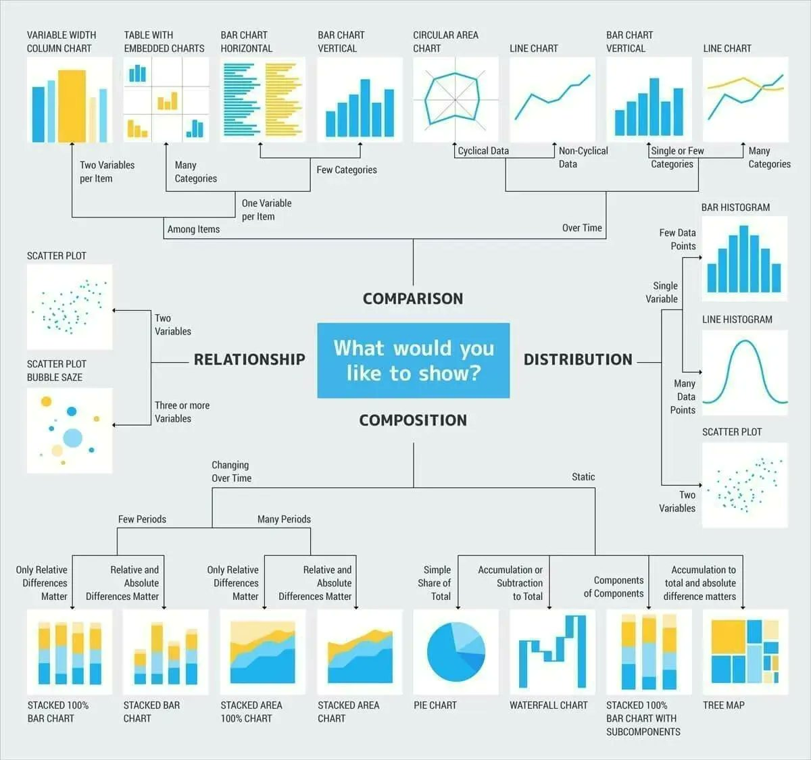
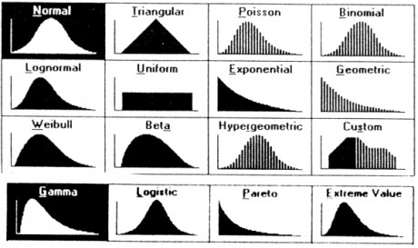
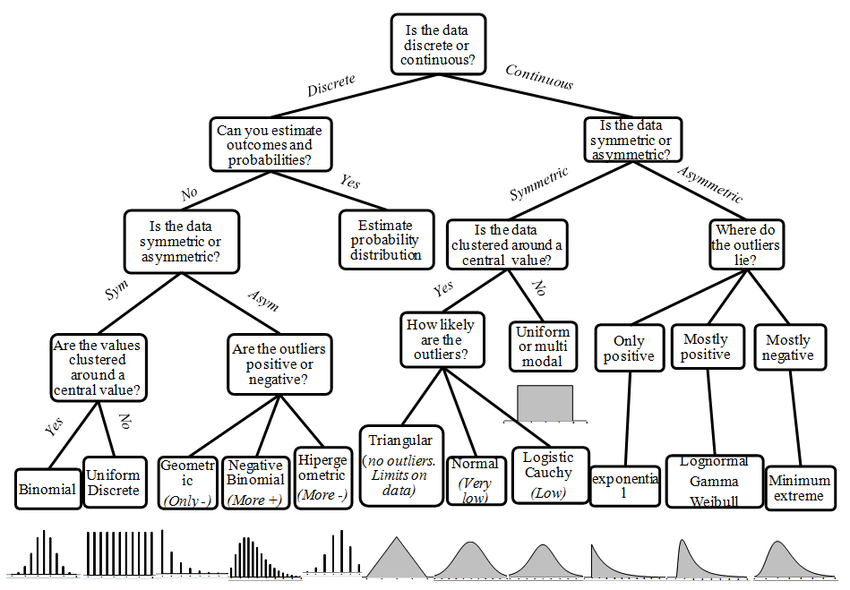
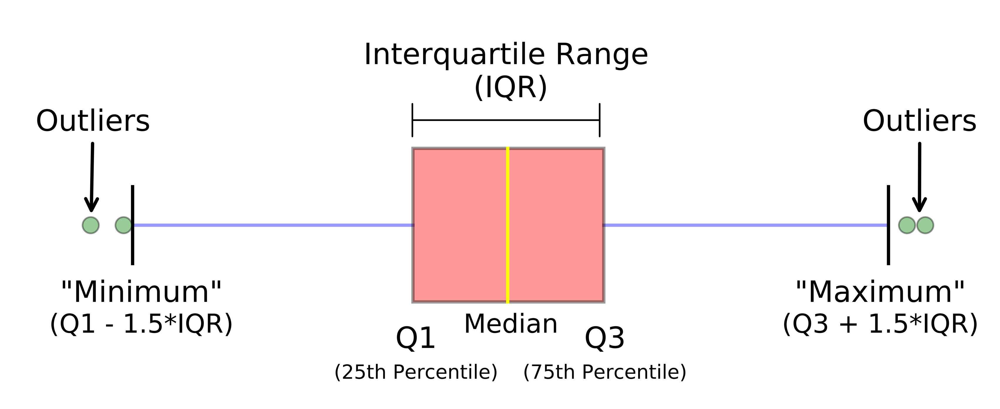
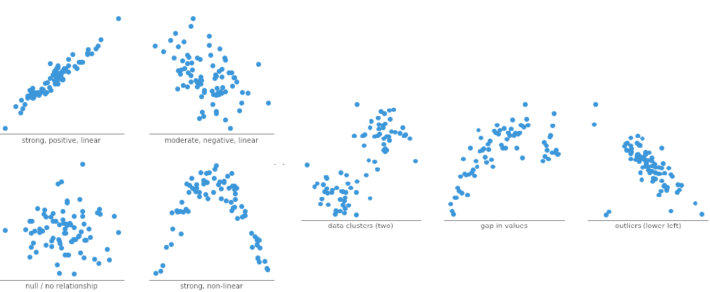
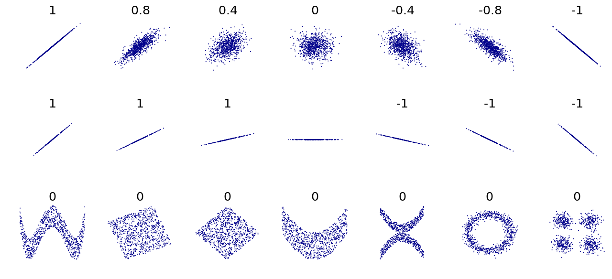
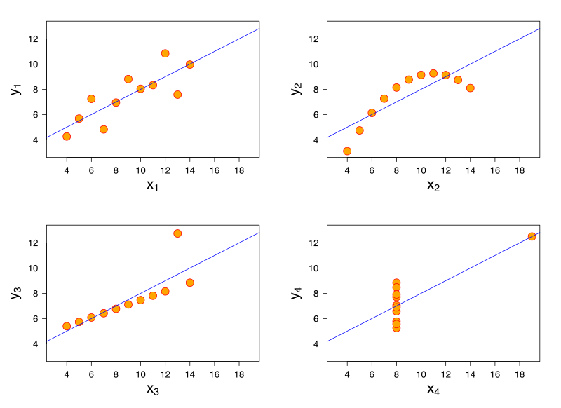

```{r setup, include = FALSE, warning = TRUE, message = FALSE}
knitr::opts_chunk$set(echo = FALSE, message = FALSE, warning = FALSE)
library(readr)
library(readxl)
library(dplyr)
library(forcats)
library(skimr)
library(fBasics)
library(janitor)
library(modelsummary)
library(gt)
library(gtsummary)
library(flextable)
library(ggplot2)
library(ggthemes)
library(patchwork)
library(PerformanceAnalytics)

carteira <- readr::read_rds("carteira.rds")
risco <- readxl::read_xlsx('risco.xlsx')
cotacoes <- readr::read_rds('cotacoes.rds')
```

## Objetivos

- Análise Exploratória de Dados (**Exploratory Data Analysis (EDA)**)
   
    - Análise Exploratória de Dados: Visão Geral
    - Análise Exploratória Numérica
    - Análise Exploratória Gráfica
    

## Análise Exploratória de Dados: Visão Geral

- [Visualize: R for Data Science, 2 ed.](https://r4ds.hadley.nz/visualize.html)

{width=90%}

[*-- Wickham & Grolemund, Visualize*]{style="float:right"}

**Import:** importar/inserir seus dados no R.

**Tidy: **Armazenar seus dados em um formato consistente.

**Transform: ** -- criando novas variáveis a partir das já existentes e 
sumarizar informações.

**Visualize:** Representar visualmente seus dados.

Esta parte do livro mostra como usar a **visualização** e a **transformação** para explorar dados de maneira sistemática.

  
- **Exploratory Data Analysis (EDA)**

EDA é um ciclo iterativo no qual:
 
    - Geramos perguntas sobre os dados.

    - Procuramos por respostas visualizando, transformando e modelando os 
      dados.

    - Usamos o que aprendemos para refinar as perguntas e/ou gerar novas      
      perguntas.

    - A EDA não é um processo formal com um conjunto estrito de regras.

    - Durante as fases iniciais da EDA, devemos nos sentir livres para 
      investigar quaisquer ideias que surjam.
  
    - Algumas ideias irão gerar frutos, outras serão descartadas.

    - Na medida em que a exploração continua, devemos nos focar em algumas 
      questões e áreas mais relevantes e produtivas.

- **Sumário:** 

A EDA é uma parte importante de qualquer análise de dados:

- Para entender as **propriedades** dos dados
- Para **estruturar os dados** no formato adequado para análise
- Para encontrar **padrões** nos dados
- Para **descrever** os dados/fenômeno
- Para identificar **erros** nos dados
- Para sugerir **estratégias de modelagem**
- Para **depurar** análises 
- Para **comunicar** resultados


## Variabilidade/Variação

- **Variação** é a tendência dos valores de uma variável aleatória de 
   mudar o valor assumido de realização para 
   realização.
  
- Variáveis categóricas também são aleatórias e podem variar se "medirmos" 
  seus diferentes níveis.

- Cada variável aleatória tem seu próprio **padrão de variação**, que pode  revelar informações importantes e interessantes. 
  
- A melhor maneira de entender um padrão é visualizar a **distribuição dos  valores da variável**.

Dois tipos de perguntas sobre os dados sempre úteis para fazer descobertas:

1. Que tipo de **variação** ocorre **dentro** das variáveis?

2. Que tipo de **covariação** ocorre **entre** as variáveis? 

O restante desta aula foca-se nestas duas perguntas.


## Análise Exploratória Numérica

**Parte 1: Arquivos de dados:**

Retornos da carteira:

```{r, echo=TRUE}
dplyr::glimpse(carteira)
```

Estrutura do objeto:

```{r}
class(carteira)
```

Amostra de dados do projeto Gestão de Risco nos Institutos Federais:

```{r, echo=TRUE}
dplyr::glimpse(risco)
```

Estrutura do objeto:

```{r, echo=TRUE}
class(risco)
```


**Parte 2: Estatísticas Descritivas em R**

1. Função `summary()`

Retornos da carteira:

```{r, echo=TRUE}
summary(carteira)
```

Gestão de Risco - Questionário:

```{r, echo=TRUE}
summary(risco)
```


2. Função `skimr::skim()`

Retornos da carteira:

```{r, echo=TRUE}
skimr::skim(carteira)
```

Gestão de Risco - Questionário:

```{r, echo=TRUE}
skimr::skim(risco)
```


**Parte 3: Preparando os dados para análise**

- Retornos da carteira: retirando dados faltantes

```{r, echo=TRUE}
carteira_analise <- na.omit(carteira)
summary(carteira_analise)
```

Criando uma estrutura de dados `longer`

```{r, echo=TRUE}
carteira_analise_longer <- carteira_analise %>% 
      tidyr::pivot_longer(cols = c('VALE', 'WEGE3.SA', 'PETR4.SA'), 
                          names_to = "acoes", 
                          values_to = "retornos")

head(carteira_analise_longer)
```

- Risco: Definindo classes apropriadas para as questões:

```{r, echo=TRUE}
risco_analise <- risco %>%
  transmute(
    q1_1 = factor(
      q1_1,
      levels = c(
        "20-30 anos",
        "31-40 anos",
        "41-50 anos",
        "51-60 anos",
        "Mais de 60 anos"
      ),
      ordered = TRUE
    ),
    q1_2 = factor(q1_2),
    q1_3 = factor(q1_3),
    q1_4 = factor(q1_4),
    q1_5 = factor(
      q1_5,
      levels =  c(
        "Ensino fundamental",
        "Ensino médio",
        "Ensino superior",
        "Especialização",
        "Mestrado",
        "Doutorado"
      ),
      ordered = TRUE
    ),
    q1_6 = factor(
      q1_6,
      levels = c(
        "Até 5 anos",
        "6-10 anos",
        "11-15 anos",
        "16-20 anos",
        "Mais de 20 anos"
      ),
      ordered = TRUE
    ),
    q1_7 = factor(
      q1_7,
      levels = c(
        "Até 5 anos",
        "6-10 anos",
        "11-15 anos",
        "16-20 anos",
        "Mais de 20 anos"
      ),
      ordered = TRUE
    ),
    q1_8 = factor(q1_8)
  )
```

Verificando o novo objeto `risco_analise``:

```{r, echo=TRUE}
skimr::skim(risco_analise)
```


**Parte 4: Estatísticas Descritivas**

- Retornos da carteira: dados numéricos

```{r, echo=TRUE}
fBasics::basicStats(carteira_analise)
```

- Gestão de Risco: dados categóricos 

```{r, echo=TRUE}
summary(risco_analise)
```

- Cotacoes

```{r}
summary(cotacoes)
```

Funções R:

```{r}
### renomeando as variaveis da data.frame carteira
retornos_vale <- carteira$VALE
retornos_weg <- carteira$WEGE3.SA
retornos_petro <- carteira$PETR4.SA
```


- **Medidas de Posição**

media amostral

```{r}
mean(retornos_petro, na.rm = TRUE)
```

mediana amostral

```{r}
median(retornos_petro, na.rm = TRUE)
```

minimo, quartis e maximo amostrais

```{r}
quantile(retornos_petro, na.rm = TRUE)
```

percentis especificos: $p_{32}$, $p_{57}$ e $p_{98}$

```{r}
quantile(retornos_petro, prob = c(.32, .57, .98), na.rm = TRUE)
```

minimo entre os elementos de um vetor

```{r}
min(retornos_petro, na.rm = TRUE)      # mínimo dos elementos do vetor
```

máximo dos elementos do vetor

```{r}
max(retornos_petro, na.rm = TRUE) 
```

- **Medidas de Variabilidade**

variância amostral

```{r}
var(retornos_petro, na.rm = TRUE)
```

desvio-padrão amostral

```{r}
sd(retornos_petro, na.rm = TRUE)  
```

desvio-absoluto mediano amostral

```{r}
mad(retornos_petro, na.rm = TRUE) 
```

intervalo interquartil amostral

```{r}
IQR(retornos_petro, na.rm = TRUE) 
```


- Gestão de Risco: dados categóricos

Tabelas de Frequência: Função `tabyl()` do pacote `janitor`

```{r, echo=TRUE}
tab1 <- risco_analise |> tabyl(q1_1)
tab1
```

```{r, echo=TRUE}
tab2 <- risco_analise |> tabyl(q1_2)
tab2
```

```{r, echo=TRUE}
tab3 <- risco_analise |> tabyl(q1_3)
tab3
```

Customizando as tabelas:

```{r, echo=TRUE}
tab4 <- risco_analise |> tabyl(q1_1) |> 
   adorn_totals(c("row")) |>
  adorn_pct_formatting(rounding = "half up", digits = 0) |>
  knitr::kable()
       
tab4
```

```{r, echo=TRUE}
tab5 <- risco_analise |> tabyl(q1_2) |> 
   adorn_totals(c("row")) |>
   adorn_pct_formatting(rounding = "half up", digits = 0) |>
   knitr::kable()

tab5
```

```{r, echo=TRUE}
tab5 <- risco_analise |> tabyl(q1_3) |> 
  adorn_totals(c("row")) |>
  adorn_pct_formatting(rounding = "half up", digits = 0) |>
  knitr::kable()

tab5
```

Tabulação cruzada:

```{r, echo=TRUE}
tab6 <- risco_analise |> tabyl(q1_2, q1_3)

tab6
```

Customizando a tabela:

```{r, echo=TRUE}
tab7 <- risco_analise |> tabyl(q1_2, q1_3) |>
  adorn_percentages("row") |>
  adorn_pct_formatting(digits = 2) |>
  adorn_ns() |>
  knitr::kable()

tab7
```


```{r, echo=TRUE}
tab8 <- risco_analise |> 
        tabyl(q1_1, q1_2, q1_3)

tab8
```


**Tabelas para Publicação Usando os pacotes `gtsummary` e `flextable`** 

Tabela: Variáveis Categóricas

```{r}
#| echo: true
#| eval: true
#| message: false

# Pacote utilizado
library(gtsummary)
library(flextable)

tabgt01 <-cotacoes %>%  
  select(-c(item, ve, vh, percent, pt)) %>% 
  tbl_summary(
    by = ano,
    statistic = list(
      all_categorical() ~ "{n} ({p}%)"
    ),
    label = list(pe ~ "Grupo Licitado", 
                 it ~ "Pesquisa de Preços (internet)",
                 cb ~ "Pesquisa de Preços (combinada)",
                 fn ~ "Pesquisa de Preços (fornecedores)",
                 pa ~ "Pesquisa de Preços (painel)"
                 ),
    digits = all_continuous() ~ 2
  ) %>%
  modify_header(label ~ "**Variável**") %>%
  modify_caption("TABELA 1. Estatísticas Descritivas: Variáveis Categóricas.") %>%
  modify_footnote(all_stat_cols() ~ " N = total de observações do ano. n = (total de observações da variável categórica/nível) (%) = porcentagem do total de observações do ano")

tabgt01

as_gt(tabgt01) %>% 
     gt::gtsave(filename = "tabs/tabgt01.rtf")
```


Tabela: Variáveis Numéricas

```{r}
#| echo: true
#| eval: true
#| message: false

tabgt02 <- cotacoes %>% select(c(ano, ve, vh, percent, pt)) %>%
  tbl_summary(
    by = ano,
    statistic = list(
      all_continuous() ~ c("({median}, {mean}) ({p25}, {p75}), ({min}, {max}) ({IQR}, {sd})")
    ),
    label = list( 
      ve ~ "Valor Estimado",
      vh ~ "Valor Homologado",
      percent ~ "Variação (%)", 
      pt ~ "Total de Fornecedores Participantes"),
    digits = all_continuous() ~ 2
  ) %>%
  modify_header(label ~ "**Variável**") %>%
  modify_caption("TABELA 2. Estatísticas Descritivas: Variáveis Numéricas.") %>%
  modify_footnote(all_stat_cols() ~ "(média, mediana) (p25, p75) (mín., máx.) (IIQ, desvio_padrão)"
  )

tabgt02

as_gt(tabgt02) %>% 
     gt::gtsave(filename = "tabs/tabgt02.rtf")
```


## Análise Exploratória Gráfica

```{r, out.width = "80%", echo = FALSE, fig.align = 'center'}

```


## Análise Exploratória Gráfica: Visualizando distribuições

Características observáveis na distribuição de variáveis numéricas

- **Simetria/Assimetria**: A distribuição é simétrica: assimétrica a esquerda ou a direita?.

- **Outliers**: Há um ou mais valores muito distantes da maioria dos dados?

- **Multimodalidade**: A distribuição possui dois ou mais picos/clusters?

- **Gaps**: Há intervalos de valores que não contém dados?

- **Erros**: Há valores fora do intervalo factível?

Por que visualizar a distribuição dos dados?

```{r fig1, out.width = "60%", echo = FALSE, fig.align = 'center'}

```


```{r fig3, out.width = "60%", echo = FALSE, fig.align = 'center'}

```

- Para encontrar um modelo probabilístico para o fenômeno aleatório em 
questão.


## Visualizando distribuições: Histograma

```{r, echo=TRUE, out.width = "60%"}
h1 <- ggplot(carteira, aes(x = VALE)) + geom_histogram()
h1
```

Customizando um Histograma

```{r, echo=TRUE, out.width = "50%"}
h1c <- ggplot(carteira, aes(x = VALE)) +
  geom_histogram() +
  labs(x = "Retornos",
       y = "Frequência",
       title = "Vale: Retornos das Ações") + 
  xlim(-0.3, 0.3) + 
  theme_minimal()
h1c
```

Histograma

```{r, echo=TRUE, out.width = "60%"}
h2 <- ggplot(carteira, aes(x = PETR4.SA)) + geom_histogram() 
h2
```

Customizando:

```{r, echo=TRUE, out.width = "50%"}
h2c <- ggplot(carteira, aes(x = PETR4.SA)) +
  geom_histogram() +
  labs(x = "Retornos",
       y = "Frequência",
       title = "Petrobrás: Retornos das Ações") + 
  xlim(-0.3, 0.3) + 
  theme_minimal()
h2c
```


```{r, echo=TRUE, out.width = "60%"}
h3 <- ggplot(carteira, aes(x = WEGE3.SA)) + geom_histogram()
h3
```

Customizando

```{r, echo=TRUE, out.width = "50%"}
h3c <- ggplot(carteira, aes(x = WEGE3.SA)) +
  geom_histogram() +
  labs(x = "Retornos",
       y = "Frequência",
       title = "WEG: Retornos das Ações") + 
  xlim(-0.3, 0.3) + 
  theme_minimal()
h3c
```


- Histograma: Múltiplos gráficos em um painel

```{r,  echo = TRUE, out.width = "60%"}
library(patchwork)
painel01 <- h1c / h2c / h3c
painel01
```


- Histograma: Múltiplos gráficos em um painel

```{r,  echo = TRUE, out.width = "60%"}
library(patchwork)
painel01 <- (h1c + h2c + h3c) + plot_layout(nrow = 2)
painel01
```

Densidade Empírica

```{r, echo=TRUE, out.width = "60%"}
d1 <- ggplot(carteira, aes(x = VALE)) + geom_density()
d1
```

Customizando 

```{r, echo=TRUE, out.width = "50%"}
d1c <- ggplot(carteira, aes(x = VALE)) +
  geom_density() +
  labs(x = "Retornos",
       y = "Densidade",
       title = "Vale: Retornos das Ações") +
  xlim(-0.3, 0.3) + 
  theme_minimal()

d1c
```

Densidade Empírica

```{r, echo=TRUE, out.width = "60%"}
d2 <- ggplot(carteira, aes(x = PETR4.SA)) + geom_density()
d2
```

Customizando 

```{r, echo=TRUE, out.width = "50%"}
d2c <- ggplot(carteira, aes(x = PETR4.SA)) +
  geom_density() +
  labs(x = "Retornos",
       y = "Densidade",
       title = "Petrobrás: Retornos das Ações") + 
  xlim(-0.3, 0.3) + 
  theme_minimal()

d2c
```

Densidade Empírica

```{r, echo=TRUE, out.width = "60%"}
d3 <- ggplot(carteira, aes(x = WEGE3.SA)) + geom_density()
d3
```

Customizando 

```{r, echo=TRUE, out.width = "50%"}
d3c <- ggplot(carteira, aes(x = WEGE3.SA)) +
  geom_density() +
  labs(x = "Retornos",
       y = "Densidade",
       title = "WEG: Retornos das Ações") +
  xlim(-0.3, 0.3) + 
  theme_minimal()
d3c
```

Densidade Empírica: Múltiplos gráficos em um painel

```{r, echo = TRUE, out.width = "60%"}
library(patchwork)
painel02 <- d1c / d2c / d3c
painel02
```

Densidade Empírica: Múltiplos gráficos em um painel

```{r, echo = TRUE, out.width = "60%"}
painel02 <- (d1c + d2c + d3c) + plot_layout(nrow = 2)
painel02
```

Histograma com Densidade Empírica

```{r, echo=TRUE, out.width = "60%"}
h1_d <- ggplot(carteira, aes(x = VALE)) + 
            geom_histogram(aes(y = ..density..)) +
            geom_density(col = "blue", size = 1.5) + 
            theme_minimal()
h1_d
```


## Visualizando distribuições: Boxplot

```{r fig, out.width = "70%", echo = FALSE, fig.align = 'center'}

```

Boxplot

```{r, echo=TRUE, out.width = "60%"}
b1 <- ggplot(carteira, aes(x = VALE)) + geom_boxplot()
b1
```

Boxplot: `coord_flip()` inverte a orientação

```{r, echo=TRUE, out.width = "60%"}
b1_inv <- ggplot(carteira, aes(x = VALE)) + geom_boxplot() + coord_flip()
b1_inv
```

Customizando

```{r, echo=TRUE, out.width = "50%"}
b1c <- ggplot(carteira, aes(x = VALE)) +
        geom_boxplot() +
        labs(x = "Retornos",
             y = NULL,
             title = "Vale: Retornos das Ações") +
        xlim(-0.3, 0.3) + 
       theme_minimal()

b1c
```

Boxplot

```{r, echo=TRUE, out.width = "60%"}
b2 <- ggplot(carteira, aes(x = PETR4.SA)) + geom_boxplot()
b2
```

Customizando

```{r, echo=TRUE, out.width = "50%"}
b2c <- ggplot(carteira, aes(x = PETR4.SA)) +
        geom_boxplot() +
        labs(x = "Retornos",
             y = NULL,
             title = "Petrobrás: Retornos das Ações") + 
       xlim(-0.3, 0.3) + 
       theme_minimal()
b2c
```

Boxplot

```{r, echo=TRUE, out.width = "60%"}
b3 <- ggplot(carteira, aes(x = WEGE3.SA)) + geom_boxplot()
b3
```

Customizando

```{r, echo=TRUE, out.width = "50%"}
b3c <- ggplot(carteira, aes(x = WEGE3.SA)) +
       geom_boxplot() +
       labs(x = "Retornos",
            y = NULL,
            title = "WEG: Retornos das Ações") +
       xlim(-0.3, 0.3) + 
       theme_minimal()

b3c
```

Boxplot: Múltiplos gráficos em um painel

```{r,  echo = TRUE, out.width = "60%"}
library(patchwork)
painel03 <- b1c / b2c / b3c
painel03
```


## Visualizando distribuições: Gráfico de Barras

Continuando com a usar o sistema de visualização do pacote `ggplot2`

```{r, echo=TRUE}
ggplot(risco_analise, aes(x = q1_1)) + 
  geom_bar() +
  labs(title="Gráfico de Barra Simples",                 
       x="Idade",                          
       y="Frequência (n)") 
```

Invertendo os eixos usando `coord_flip()`:

```{r, echo=TRUE}
ggplot(risco_analise, aes(x = q1_1)) + 
  geom_bar() +
  labs(x="Idade",                          
       y="Frequência (n)") + 
  coord_flip() + 
  theme_minimal()
```

reordenando os níveis do fator idade:

```{r, echo=TRUE}
ggplot(risco_analise, aes(x = fct_rev(q1_1))) + 
  geom_bar() +
  labs(x="Idade",                          
       y="Frequência (n)") + 
  coord_flip() + 
  theme_minimal()
```


Diferenciando as categorias com cores:

```{r, echo=TRUE}
ggplot(risco_analise, aes(x = fct_rev(q1_1), fill = q1_1)) + 
  geom_bar() +
  labs(x= "Idade",                          
       y = "Frequência (n)") + 
  coord_flip() + 
  theme_minimal()
```

Anotando as barras: porcentagens

```{r, echo=TRUE}
risco_anot <- risco_analise |>
  group_by(q1_1) |>
  summarize(n = n()) |>
  mutate(
         pct = n / sum(n),
         lbls = scales::percent(pct)
        )


ggplot(risco_anot, aes(x = q1_1, y = pct, fill = q1_1)) +
  geom_bar(stat = "identity", fill = "steelblue") +
  geom_text(aes(label = lbls),
            vjust = -0.5,
            size = 3) + 
  labs(x = "Idade",
       y = "Frequência (n)") +
  theme_minimal()
```

Anotando as barras: totais

```{r, echo=TRUE}
risco_anot2 <- risco_analise |>
  group_by(q1_1) |>
  summarize(n = n()) |>
  mutate(
         total = n,
         lbls = scales::number(total)
        )


ggplot(risco_anot2, aes(x = q1_1, y = total, fill = q1_1)) +
  geom_bar(stat = "identity", fill = "steelblue") +
  geom_text(aes(label = lbls),
            vjust = -0.5,
            size = 3) + 
  labs(x = "Idade",
       y = "Frequência (n)") +
  theme_minimal()
```


## Covariação entre Variáveis Numéricas

Gráficos de Dispersão:

```{r fig06, out.width = "95%", echo = FALSE, fig.align = 'center'}

```

Covariação: Dispersão e $r_{xy}$ 

```{r fig07, out.width = "90%", echo = FALSE, fig.align = 'center'}

```

- verbete na [wikipedia](https://en.wikipedia.org/wiki/Pearson_correlation_coefficient) 

- Covariação: Quarteto de Ascombe

```{r fig08, out.width = "60%", echo = FALSE, fig.align = 'center'}

```

- Analise o verbete na [wikipedia](https://en.wikipedia.org/wiki/Anscombe%27s_quartet)


Covariação: Gráfico de Dispersão

```{r, out.width = "60%", echo = TRUE, fig.align = 'center'}
ggplot(data = carteira) +
  geom_point(mapping = aes(x = VALE, y = PETR4.SA))
```


Covariação: Gráfico de Dispersão

```{r, out.width = "60%", echo = TRUE, fig.align = 'center'}
ggplot(data = carteira) +
  geom_bin2d(mapping = aes(x = VALE, y = PETR4.SA))
```

Covariação: Gráfico de Dispersão

```{r, out.width = "60%", echo = TRUE, fig.align = 'center'}
ggplot(data = carteira) +
  geom_point(mapping = aes(x = VALE, y = PETR4.SA)) +
  geom_smooth(mapping = aes(x = VALE, y = PETR4.SA), method = "lm", se = FALSE)
```

Covariação: Gráfico de Dispersão

```{r, out.width = "60%", echo = TRUE, fig.align = 'center'}
ggplot(data = carteira) +
  geom_point(mapping = aes(x = WEGE3.SA, y = PETR4.SA))
```

Covariação: Gráfico de Dispersão

```{r, out.width = "60%", echo = TRUE, fig.align = 'center'}
ggplot(data = carteira) +
  geom_bin2d(mapping = aes(x = WEGE3.SA, y = PETR4.SA))
```

Covariação: Gráfico de Dispersão

```{r, out.width = "60%", echo = TRUE, fig.align = 'center'}
ggplot(data = carteira) +
  geom_point(mapping = aes(x = WEGE3.SA, y = PETR4.SA)) +
  geom_smooth(mapping = aes(x = WEGE3.SA, y = PETR4.SA), method = "lm", se = FALSE)
```

Covariação: Gráfico de Dispersão

```{r, out.width = "60%", echo = TRUE, fig.align = 'center'}
ggplot(data = carteira) +
  geom_point(mapping = aes(x = WEGE3.SA, y = VALE))
```    

Covariação: Gráfico de Dispersão

```{r, out.width = "60%", echo = TRUE, fig.align = 'center'}
ggplot(data = carteira) +
  geom_bin2d(mapping = aes(x = WEGE3.SA, y = VALE))
```

Covariação: Gráfico de Dispersão

```{r, out.width = "60%", echo = TRUE, fig.align = 'center'}
ggplot(data = carteira) +
  geom_point(mapping = aes(x = WEGE3.SA, y = VALE)) +
  geom_smooth(mapping = aes(x = WEGE3.SA, y = VALE), method = "lm", se = FALSE)
```

Tudo ao Mesmo Tempo 

```{r, out.width = "80%", echo = TRUE, fig.align = 'center'}
library(PerformanceAnalytics)
chart.Correlation(carteira, histogram = TRUE)
```


## Gráficos de Linha para Séries Temporais

Características observáveis em gráficos de séries temporais:

- **Tendência**: É o crescimento ou decrescimento de longo prazo observado 
                 nos dados. 

- **Sazonalidade**: Um padrão sazonal ocorre quando uma série temporal é afetada                      por fatores sazonais, como a época do ano ou o dia da semana.

- **Ciclos**: Um ciclo ocorre se observamos crescimentos e decrescimento nos 
               dados não apresentam um período fixo.


```{r, echo = FALSE, warning = FALSE, message = FALSE}
plot(AirPassengers,
     xlab = "Mês",
     ylab = "Total de Passageiros (1000's)",
     main = "Total de Passageiros entre 1949 e 1961", 
     col = "blue")
grid()
```


**Sistema Gerenciador de Séries do Banco Central do Brasil**

- Todo pesquisador de finanças e economia deve conhecer o [Sistema Gerenciador 
de Séries Temporais](https://www3.bcb.gov.br/sgspub/localizarseries/localizarSeries.do?method=prepararTelaLocalizarSeries) do Banco Central do Brasil.

- Pacotes `R` que se comunicam com a API do Banco Central:

    - [GetBCBData](https://github.com/msperlin/GetBCBData/)
    - [BETS](https://cran.r-project.org/web/packages/BETS/vignettes/BETS_basic_usage.html)


```{r, echo = TRUE, message = FALSE, eval = FALSE}
library(GetBCBData)
library(ggplot2)

# define ids
id.series <- c(utilizacao_capacidade_instalada = 1344)
first.date = '2010-01-01'

# obtem serie do bcb
df_uci <- gbcbd_get_series(id = id.series,
                            first.date = first.date,
                            last.date = Sys.Date(), 
                            use.memoise = FALSE)

# grafico de linha via ggplot2
ggplot(data = df_uci, aes(x = ref.date, y = value)) + 
  geom_line(color = "blue") + 
  labs(x = 'Trimestre', y = 'Utilização da Capacidade Instalada (%)', 
       title  = 'Utilização da capacidade instalada - Geral (FGV)',
       subtitle = "Periodicidade: Trimestral",
       caption = "Fonte: Elaborado pelo Autor com dados da FGV") 
```

Gráfico de Linha para Séries Temporais

```{r, echo = FALSE, message = FALSE, eval = TRUE}
library(GetBCBData)
library(ggplot2)

# define ids
id.series <- c(utilizacao_capacidade_instalada = 1344)
first.date = '2002-01-01'

# obtem serie do bcb
df_uci <- gbcbd_get_series(id = id.series,
                            first.date = first.date,
                            last.date = Sys.Date(), 
                            use.memoise = FALSE)

# grafico de linha via ggplot2
ggplot(data = df_uci, aes(x = ref.date, y = value)) + 
  geom_line(color = "blue") + 
  labs(x = 'Trimestre', y = 'Utilização da Capacidade Instalada (%)', 
       title  = 'Utilização da capacidade instalada - Geral (FGV): 2002/2022',
       subtitle = "Periodicidade: Trimestral",
       caption = "Fonte: Elaborado pelo Autor com dados da FGV") 
```


