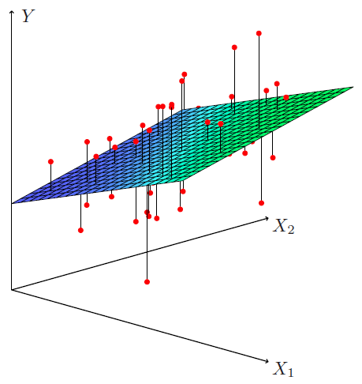

<style type="text/css">
  body{
  font-size: 11pt;
  text-align: justify
      }
</style>

```{r setup, include=FALSE}
knitr::opts_chunk$set(echo = TRUE)
```


## Referências

BROOKS, Chris.. **Introductory Econometrics for Finance**. 4 ed.
Cambridge University Press, 2019. Capítulos: 3, 4 e 5.

WICHMANN, Robert; BROOKS, Chris **R Guide to Accompany Introductory Econometrics for Finance 4 edition**. 2019. Capítulos: 3, 4, 5, 6 e 7.


## Modelos de Regressão Linear

> <div style="text-align: right">**"Essentially, all models are wrong, but some are useful"**</div>

<div style="text-align: right">*George Box*</div>

Considere os seguintes dados sobre vendas e publicidade:

```{r advert, out.width = "95%", echo = FALSE, fig.align = 'center'}

```

Perguntas que podemos fazer:

- Existe uma relação entre o orçamento de publicidade e vendas?
- Quão forte é a relação entre o orçamento de publicidade e vendas?
- Quais mídias contribuem para as vendas?
- Com que precisão podemos prever as vendas futuras?
- A relação é linear?
- Existe sinergia entre as mídias publicitárias?


## Modelos/Análise de Regressão Linear

- Um Modelo de regressão é provavelmente a ferramenta mais importante à 
disposição de um cientista social envolvido em pesquisas quantitativas.

- Mas o que é a análise de regressão?

- **Técnica estatística que busca descrever e avaliar a relação entre uma determinada variável aleatória $\mathbf{y}$ e uma ou mais outras variáveis $\mathbf{x}$, consideradas fixas**.

- Termos usados e equivalentes para $y$ e $x$:

| $y$                    | $x$                      |
|:----------------------:|:------------------------:| 
| variável independente  | variável dependente      |
| variável **resposta**  | variáveis **preditora**  |  
| variável explicada     | variável **explicativa** |
| variável de efeito     | variável causal          |
| variável endógena      | variável exógena         |

- Variável Resposta = $y$

- Em modelos de regressão linear clássicos a variável resposta $y$ é **aleatória, numérica e contínua**.

- $Y$ pode ser também **numérica discreta** ou **categórica**, mas devemos usar uma classe mais ampla de modelos (Modelos Lineares Generalizado, por exemplo, 
entre outros).

- Variáveis Explicativas/Preditoras = $x_1,x_2,\ldots,x_k$

- As variáveis preditoras $x_1,x_2,\ldots,x_k$ sao **fixas** e podem ser 
contínuas, discretas ou categóricas.


### Tipos de Modelos de Regressão

```{r tipos, out.width = "50%", echo = FALSE, fig.align = 'center'}
knitr::include_graphics("img/tipos.png")
```


## Modelos de Regressão Simples e Múltipla

Modelo de Regressão Linear Simples:

$$
\begin{align*}
Y_{i} &= \beta_0 + \beta_1 X_1 + \epsilon_{i} \quad (i = 1,\ldots,n) \\
\epsilon_{i} &\sim N(0,\sigma^2)
\end{align*}			
$$

Modelo de Regressão Linear Múltipla

$$
\begin{align*}
Y_{i}        &= \beta_0 + \beta_1 X_{1} + \beta_2 X_{2} + \ldots + \beta_p X_{k} + \epsilon_{i} \quad (i = 1,\ldots,n) \\
\epsilon_{i} &\sim N(0,\sigma^2) \\
(k - 1)  &\,\,\text{variáveis preditoras} \,\,(X_1,X_2,\ldots,X_k)
\end{align*}	
$$


### Por que incluímos o erro aleatório ($\epsilon_i$)?

- Incluímos o erro aleatório ($\epsilon_{i} \sim N(0,\sigma^2)$) para 
  tentarmos capturar vários fatores.

1. Sempre deixamos de fora alguns determinantes de $y_i$;

2. Pode haver erros na medição de $y_i$;

3. Influências externas aleatórias em $y_i$ que não podemos modelar.


### Representação Matricial

```{r fig06, out.width = "60%", echo = FALSE, fig.align='center'}
knitr::include_graphics("img/fig06.png")
```

$$
Y = X\beta + \epsilon
$$

A representação de modelos estatísticos usando matrizes e a álgebra linear 
para operá-las, além de fornecer uma notação compacta e abstrata, permite 
o desenvolvimento de algoritmos numericamente eficientes e estáveis.


## Aplicações em Finanças

- Regressão Linear Simples:

    - Como o retorno de ativos varia com seu nível de risco de mercado (CAPM)
    - Mensuração da relação de longo prazo entre preços de ações e dividendos
    - Estimação da razão ótima de hedge
    - ...

- Regresão Linear Múltipla:

    - Modelos Hedônicos de Precificação de Casas
    - Modelos Fatoriais (APT)
    - Estimativa de Custos
    - ...


    
## Linearidade

Para ser linear, um modelo de regressão **deve ser linear em relação aos parâmetros** ($\beta$). O modelo não precisa necessariamente  ser linear em relação às variáveis preditoras/explicativas.

Linear nos parâmeros, significa que estes não são multiplicados 
($\beta_1*\beta_2$), divididos ($\frac{\beta_1}{\beta_2}$), elevados a alguma 
potência ($\beta_1^2$) etc.

Alguns modelos podem ser linearizados:

$$
\begin{align*}
y_i       &= e^{\alpha} x_{i}^{\beta} e^{u_i} \\
\ln (y_i) &= \alpha + \beta \ln (x_i) + u_i
\end{align*}
$$

Devido à linearidade em relação aos parâmetros, uma **regressão polinomial** 
pode ser caracterizada como um tipo de modelo de regressão linear:

$$
y_i = \beta_{0} + \beta _{1}x+ \beta _{2}x^{2} + \beta _{3}x^{3}+ \cdots +\beta _{n}x^{n} + \epsilon_i
$$

```{r pol, out.width = "60%", echo = FALSE, fig.align='center'}

```


## Regressão: Visualização

### Regressão Linear Simples ($k = 1$)

```{r line, out.width = "50%", echo = FALSE, fig.align='center'}
knitr::include_graphics("img/fitline.png")
```

- Ajuste de MQ da regressão de `Sales` contra `Tv`

- Neste caso, o modelo linear captura a essência do relação,
  embora seja um pouco deficiente nos dados iniciais (esquerda do 
  gráfico). 
  


### Regressão Linear Múltipla ($k = 2$)

```{r plano, out.width = "50%", echo = FALSE, fig.align='center'}

```


## Modelos de Regressão: Esperança Condicional

Regressão = Valor Esperado Condicional:

$$
\begin{align*}
Y_{i}                      &= \beta_0 + \beta_1 X_{1} + \ldots + \beta_p X_{p} + \epsilon_{i} \\
\epsilon_i                 &\sim N(0,\sigma^2) \\
E(Y_{i}|X_{1}\ldots X_{p}) &= E(\beta_0 + \beta_1 X_{1} + \ldots + \beta_p X_{p} + \epsilon_{i}) \\
E(Y_{i}|X_{1}\ldots X_{p}) &= \hat{Y}_{i} =\hat{\beta}_o + \hat{\beta_1} X_{1} + 
\ldots + \hat{\beta_p} X_{p} \\
\hat{\epsilon}_{i} &= Y_{i} - \hat{Y}_{i} \sim N(0,\sigma^2)
\end{align*}
$$

$\epsilon$ = erro 

$\hat{\epsilon}$ = resíduo


```{r condicional, out.width = "70%", echo = FALSE, fig.align='center'}
knitr::include_graphics("img/condicional.png")
```


## Estimação dos Parâmetros por Mínimos Quadrados Ordinários

Método dos Mínimos Quadrados Ordinários:

Pelo método dos MQO, desejamos encontrar a equação da reta/plano que melhor 
se ``ajusta'' aos dados. Isto implica em encontrar estimadores de $\beta_1,\beta_2,\ldots,\beta_p$ que minimizam a soma de quadrado dos resíduos:	

$$
\begin{align*}
\hat{\epsilon_i} &= y_i - \hat{y_i} \\
\sum \hat{\epsilon_i}^2 &= \sum (y_i - \hat{y_i})^2 \\
Min	& \sum_{i=1}^{n} (y_i - \beta_0 - \beta_1 X_{i1} - \beta_2 X_{i2} - \ldots - \beta_p X_{ip})^2 \\
Min & \,\, \hat{\epsilon_i}^{t} \hat{\epsilon_i} = (X\hat{\beta} - Y)^t(X\hat{\beta} - Y)
\end{align*}	
$$


### Geometria dos Mínimos Quadrados Ordinários

```{r least, out.width = "60%", echo = FALSE, fig.align='center'}
knitr::include_graphics("img/leastsq.png")
```


### Estimadores de MQO dos parâmetros 

Regressão Simples: 

$$
\begin{align*}
\hat{\beta_1} &= \frac{\sum(y_i - \bar{y})(x_i - \bar{x})}{\sum (x_i - \bar{x})^2} \\
\hat{\beta_0} &= \bar{y} - \hat{\beta}\bar{x}
\end{align*}
$$	
	
Regressão Múltipla - Matrizes: 

$$
\begin{equation*}
\hat{\beta} = 
\begin{bmatrix}
\hat{\beta_0} \\
\hat{\beta_1} \\
\vdots
\hat{\beta_p}  
\end{bmatrix}
= 
(X'X)^{-1}X'Y
\end{equation*}
$$	


## Modelo Clássico de Regressão Linear: Hipóteses


|Hipótese                                |  Interpretação                                |
:--------------------------------------- |:----------------------------------------------|
|H1. $E(\epsilon_i|X_i) = 0$             | erros tem média 0                             |
|H2. $V(\epsilon_i|X_i) = \sigma^2 < \infty$ | variância finita e constante              |
|H3. $Cov(\epsilon_i,x_i) = 0$           | Não há correlação entre $\epsilon_i$ e $x_i$  | 
|H4. $Cov(\epsilon_i,\epsilon_i) = 0$    | erros não são linearmente correlacionados     | 
|H5: $\epsilon_i \sim N(0,\sigma^2)$     | erros tem distribuição aprox. normal.         |   


## Propriedades dos Estimadores de MQO

- **H1**, **H2**, **H3** e **H4**

    - Garantem que os estimadores de MQO são os **melhores estimadores lineares 
      não viesados**, segundo o [Teorema de Gauss-Markov](https://en.wikipedia.org/wiki/Gauss%E2%80%93Markov_theorem). 

- **H5**

    - Necessária para fazermos inferências (testes de hipóteses, intervalos de 
      confiança, intervalos de previsão) sobre os parâmetros do modelo     
      $(\beta_0,\beta_1,\ldots,\beta_p)$	

- **Consistentes**

    - Os estimadores de MQO ($\hat{\beta}$) são consistentes. Ou seja, as 
      estimativas convergirão para seus valores verdadeiros (populaciconais) 
      à medida que o tamanho da amostra aumenta.

- **Não-Viesados**

    - Os estimadores de ($\hat{\beta}$) são não-viesados. Isto é, 
      $E(\hat{\beta}) = \beta$. Assim, em média, o valor estimado será igual 
      aos valores verdadeiros.
    
- **Eficientes**

    - Um estimador $\hat{\beta}$ de um parâmetro populacional $\beta$ é 
    eficiente, se é não-viesado e nenhum outro estimador não-viesado tem 
    variância inferior.
    
- Não-Viesados e Eficientes:

```{r unbiased, out.width = "60%", echo = FALSE, fig.align='center'}
knitr::include_graphics("img/unbiased.png")
```


## Quantificando a Incerteza: Precisão e Erros-Padrão

- Qualquer conjunto de estimativas de regressão são específicos para a 
amostra usada em sua estimativa.

- Como utilizamos apenas uma amostra da população possível, cometemos 
erros nas estimativas, temos incerteza.

- Precisamos de medidas da precisão da regressão ($\hat{\sigma}^2$) e 
das estimativas dos parâmetros $V(\hat{\beta})$.


### Estimador da Precisão do Modelo ($\hat{\sigma}^2$)

- Dadas **H1**, **H2**, **H3** e **H4**, um  estimador não viesado da 
variância/Erro-Padrão da Regressão é:

$$
\begin{align*}
\sqrt{\hat{\sigma}^2} &= \frac{1}{n-k} \sum_{i=1}^{n} (Y_i - \hat{Y}_i)^2 \\
\sqrt{\hat{\sigma}^2} &=  \sqrt{\frac{(Y - X\hat{\beta})'(Y - X\hat{\beta})}{n - k}} 
\end{align*}
$$
	


### Estimador da Precisão dos Parâmetros ($V(\hat{\beta})$)

Estimador da Matriz de Variância-Covariância dos Parâmetros:

$$
V(\hat{\beta}) = \hat{\sigma}^2  (X'X)^{-1} = \hat{\sigma}^2
\begin{bmatrix}
V(\hat{\beta_0})                    &                                   &                     \\
COV(\hat{\beta_0},\hat{\beta_1})    & V(\hat{\beta_1})                  &                     \\
COV(\hat{\beta_0},\hat{\beta_2})    & COV(\hat{\beta_1},\hat{\beta_2})  & V(\hat{\beta_2})
\end{bmatrix}
$$

- Estimador do erro-padrão dos parâmetros:

$$
EP(\hat{\beta}) = \sqrt{V(\hat{\beta})} = \hat{\sigma}^2(X^{t}X)^{-1}
$$


	
### Estimador da Precisão dos Parâmetros ($V(\hat{\beta}$)

- Esses erros padrão são usados para calcular **intervalos de confiança**. A 
forma geral dos intervalos para as estimativas dos parâmetros é:

$$
\hat{\beta_1} \pm 2 \times EP(\hat{\beta_1})
$$


## Inferência Estatística para o Modelo Clássico de Regressão Linear


### Estimação de Modelo de Regressão em R

```{r, out.width = "80%", echo = FALSE, fig.align='center'}
knitr::include_graphics("img/fig08.png")
```


### Inferência Estatística

-  Em geral, queremos fazer inferências sobre os parâmetros populacionais 
($\beta$) a partir das estimativas destes parâmetros obtidas a partir 
das amostras ($\hat{\beta}$).

- Como vimos, podemos usar as informações da amostra para fazer inferências sobre a 
população.

- Os principais procedimentos de inferência estatística para modelos de regressão 
são:

    - intervalos de confiança para os parâmetros $\beta$
    - Testes de Hipóteses (ou de significância) para os parâmetros $\beta$]
    - intervalos de predição para $y_0$


### Intervalos de Confiança (para os parâmetros $\beta$)

- As estimativas dos erros-padrão da regressão e dos parâmetros são usadas para 
obtermos estimativas de **intervalos de confiança** para os parâmetros $\beta$].

- A forma geral dos intervalos de confiança para as estimativas dos parâmetros, 
com 95\% de confiança é:

$$
\begin{align*}
\hat{\beta_1} &\pm 2 \times EP(\hat{\beta_1}) \\
(\hat{\beta_1} - 2 \times EP(\hat{\beta_1})&, \,\,\hat{\beta_1} + 2 \times EP(\hat{\beta_1}))
\end{align*}
$$

### Intervalos de Predição para $y_0$

- A capacidade de prever valores futuros ($y_0$) da variável resposta ($y$) é 
um dos objetivos da análise de regressão linear.

- Dado o modelo e as hipóteses **H1** até **H6**, para um determinado valor 
da variável preditora $x_0$ (que não faz parte da amostra), o valor da variável 
resposta $y_0$, que é dado por:

$$
\hat{y}_0 = \hat{\beta_0} + \hat{\beta_1}x_0
$$

- Para um modelo de regressão linear simples, um IP para $y_0$, temos:

$$
\begin{align*}
\hat{y}_0 &\pm  t_{c} EP(f) \\
Ep(f) &= \sqrt{Var(\hat{y}_0 - y_0)} = \hat{\sigma}_{0}^2 \Bigl(1 + \frac{1}{n} \frac{(x_0 - \bar{x})^2}{\sum (x_i - \bar{x})^2} \Bigr)   
\end{align*}
$$


### Testes de Hipóteses/Significância {.small}

- O teste de hipótese mais comum envolve testar as seguintes 
  hipóteses:

$H_0$: Não há evidência de relação entre $X$ e $Y$

$H_A$: Há evidência de relação entre $X$ e $Y$

- Matematicamente, isso corresponde a testar:

$H_0: \beta_1 = 0$

$H_0: \beta_1 \neq 0$

- Pois se $\beta_1 = 0$, então o modelo de regressão linear simples torna-se 
$Y = \beta_0 + \epsilon$, e não relação entre $X$ e $Y$.


### Testes de Hipóteses: Teste $F$

**Teste F**: Testa se todas as estimativas dos parâmetros são iguais a zero.

$$
\begin{align*}
H_0:\,\, & \beta_0 = \beta_1 = \ldots = \beta_p = 0   \\
H_A:\,\, & \text{Pelo menos um} \,\, \beta_p \neq 0	\\
F &= \Biggl(\frac{SQ_{total} - SQ_{residuo}}{SQ_{residuo}}\Biggr) \frac{n - p}{p - 1} \sim F_{(q,n-(p+1))}
\end{align*}	
$$

- **Se valor-p** $<$ **0.05** -> Pelo menos uma estimativa de um parâmetro é 
 estatisticamente diferente de zero

- **Se valor-p** $>$ **0.05** -> Nenhuma estimativa de parâmetro é estatisticamente 
diferente de zero 

- O teste $F$ é um instrumento para avaliar a significância global do modelo.


### Testes de Hipóteses: Teste $t$

- Teste t: Testa se cada estimativa é diferentes de zero: 

$$
\begin{align*}
H_0:\,\, & \beta_p = 0    \\
H_A:\,\, & \beta_p \neq 0	\\
t    & = \frac{\hat{\beta} - 0}{EP(\hat{\beta})}  \sim t_{(n-p,\alpha)}
\end{align*}	
$$

- Usando um software estatístico, é fácil calcular a probabilidade de observar 
  um valor igual o maior que $|t|$, ou seja, o **valor-p**.

-  **Se valor-p** $<$ **0.05** -> A estimativa **é** estatisticamente 
   diferente de zero.

- **Se valor-p** $>$ **0.05** -> A estimativa **não é** estatisticamente 
  diferente de zero.


### Testes de Hipóteses/Significância em R

```{r, out.width = "80%", echo = FALSE, fig.align='center'}
knitr::include_graphics("img/fig08.png")
```


### Testando Múltiplas Hipóteses: Teste$-F$

- Usamos o teste$-t$ para testar hipóteses únicas, ou seja, hipóteses
envolvendo apenas um parâmetro. Mas e se quisermos testar mais de um 
parâmetro **simultaneamente**?

- Fazemos isso usando o Teste$-F$. O Teste$-F$ envolve estimar 2 regressões:

    - Uma regressão **irrestrita**
    - Uma regressão **restrita**
    
- Considere o seguinte modelo de regressão múltipla:

$$
Y_{i} = \beta_0 + \beta_1 X_{1} + \beta_2 X_{2} + \beta_3 X_{3} + \epsilon_{i}
$$
E que desejamos testar $H_0:\,\beta_2 + \beta_3 = 1$ ou $H_0:\, \beta_2 = 1$

a regressão irrestrita é:

$$
Y_{i} = \beta_0 + \beta_1 X_{1} + \beta_2 X_{2} + \beta_3 X_{3} + \epsilon_{i}
$$
a regressão restrita é: 

$$
\begin{align*}
Y_{i} &= \beta_0 + \beta_1 X_{1} + \beta_2 X_{2} + \beta_3 X_{3} + \epsilon_{i} \,\, sujeito\,\,a \quad (\beta_2 + \beta_3 = 1) \\
Y_{i} &= \beta_0 + \beta_1 X_{1} + \beta_2 X_{2} + (1-\beta_2) X_{3} + \epsilon_{i} \\
Y_{i} &= \beta_0 + \beta_1 X_{1} + \beta_2 X_{2} + X_{3} - \beta_2 X_{3} + \epsilon_{i} \\
Y_{i} -  X_{3} &= \beta_0 + \beta_1 X_{1} + \beta_2 (X_{2} - X_{3}) + \epsilon_{i} \\
\end{align*}
$$


### Testando Múltiplas Hipóteses: Teste$-F$

- Estatística de Teste e Distribuição:

$$
F_{calc} = \Biggl(\frac{SQR_{restrito} - SQR_{irrestrito}}{SQR_{irrestrito}}\Biggr) \frac{n - k}{m} \sim F_{(m,n-k)}
$$
sendo: $n=$ n. de observações, $k=$ número de preditores na regressão 
irrestrita e $m = $ número de restrições.

Rejetia-se $H0$ contendo a restrição se $F_{calc} > F_{(m,n-k)}$, ou 
de analisando-se o valor-p:

- **Se valor-p** $<$ **0.05** -> Os resultados fornecem evidência para  
rejeitar a $H0$ contendo a restrição.

- **Se valor-p** $>$ **0.05** -> OS resultados fornecem evidência para 
não rejeitar a $H0$ contendo a restrição.


### Testando Múltiplas Hipóteses: Teste$-F$

- Determinando o número de restrições em um teste$-F$:

| $H_0$ : Hipóteses                                    | N. de Restrições ($m$) |
|:---------------------------------------------------- |:---------------------- |
| $H_0:\,\beta_2 + \beta_3 = 1$                        | 1                      |
| $H_0:$ $\beta_2 = 1$ e $\beta_3 = -1$                | 2                      |
| $H_0:$ $\beta_1 = 0$, $\beta_2 = 0$ e $\beta_4 = 0$  | 3                      |


## Regressão: Diferentes Abordagens

### Statistical Modelling: The Two Cultures

Abordagem: **Ciência dos Dados/Aprendizagem de Máquina**: 

Dadas as estimativas $\hat{\beta}_0, \hat{\beta}_1,\ldots,\hat{\beta}_p$ 
o foco está em obter previsões ($\hat{y_i}$). Para modelos de regressão linear, 
pela fórmula:

$$
\hat{y}_0 = \hat{\beta}_0 + \hat{\beta}_1 x_1 + \ldots,\hat{\beta}_p x_p
$$

Abordagem: **Científica Tradicional**

Em geral, tem-se um modelo que tenta descrever como $X$ $\rightarrow$ $Y$. 
Na cultura científica tradicional, o intersse em geral está nas estimativas 
$\hat{\beta}_0, \hat{\beta}_1,\ldots,\hat{\beta}_p$. Exemplo: CAPM.

$$
E(R_{i})=R_{f}+\beta _{im}(E(R_{m})-R_{f})
$$


## Acurácia Explicativa e Preditiva 


### Avaliação da Acurácia Explicativa 


- $R^2$ = coeficiente de determinação

$$
R^2 = \frac{\sum_{i = 1}^{n} (y_{i} - \bar{y})^2 - \sum_{i = 1}^{n} (y_{i} - \hat{y})^2}{\sum_{i = 1}^{n} (y_{i} - \bar{y})^2} = \frac{SQT - SQR}{SQT}
$$

**Interpretação:** $R^2$ mede a porcentagem da variação total dos dados ($SQT$) que é explicada pelo modelo ($SQT - SQR$). 	
	

$R_{ajustado}^2$: Coeficiente de Determinação Ajustado

$$
R^2 = 1 - \Bigl[ \frac{n - 1}{n - k} (1 - R^2)\Bigr]
$$

$R_{ajustado}^2$ é preferível a $R^2$		 	


### Avaliação da Acurácia Preditiva

- Root-Mean-Square Error: 

$$
 {RMSE} ={\sqrt {\frac {\sum _{t=1}^{n}({\hat {y}}_{i}-y_{i})^{2}}{n}}}
$$


- Mean Absolute Error

$$
MAE = \frac{\sum_{i=1}^{n}|{\hat {y}}_{i}-y_{i}|}{n}
$$


## Interpretação das Estimativas dos Parâmetros


### Interpretação do Intercepto ($\beta_0$)
 
- $\hat{b}_0$: Estimativa de $y$ quado as variáveis preditoras são 
iguais a zer, $X = 0$.

- $\hat{b}_0$: É preciso cuidado na interpretação (principalmente quando 
há poucas ou nenhuma observação próxima ao eixo $y$, veja fig.). Nem sempre a 
estimativa faz sentido ou e em diversos casos, não há interesse 
nesta estimativa.

```{r, out.width = "30%", echo = FALSE, fig.align='center'}
knitr::include_graphics("img/interc.png")
```


### $X$ Numéricos: Interpretação das Estimativas dos Parâmetros

- Interpretação de $\hat{\beta}$:

$$
\frac{\partial \hat{y_{i}}}{\partial X_{i}}  = \hat{\beta_i}
$$ 

 \hat{\beta} mensura o efeito médio sobre $Y$ do aumento de uma unidade em 
 $X$, mantendo todas as outras preditoras $X$ constantes. 

 
### $X$ binária: Interpretação dos Estimadores

Variável Binária ou *dummy*

$$
x_i = 
\begin{cases}
1 & \text{se i-ésima pessoa é mulher}, \\
0 & \text{se i-ésima pessoa é homem}
\end{cases}
$$

Modelo resultante:

$$
y_i = \beta_0 + \beta_1\ x_i + \epsilon_i = 
\begin{cases}
\beta_0 + \beta_1 + \epsilon_i & \text{se i-ésima pessoa é mulher},\\
\beta_0 + \epsilon_i & \text{se i-ésima pessoa é homem}
\end{cases}
$$

**Interpretação**: $\beta_1$ é a diferença média em $y_i$ entre o nível 
para o qual $x_i = 0$ (o nível de referência) e a 
categoria para a qual $x_i = 1$ (o nível de comparação). 


### $X$ Categórica: Interpretação dos Estimadores

- Podemos lidar com variáveis categóricas contendo mais de dois níveos, basta 
atribuir a cada uma das categorias sua própria variável binária:

- Com variáveis com mais de duas categorias, as estimativas dos parâmetros 
devem ser interpretadas em relação a uma categoria que deve não pode ser 
incluída no modelo, chamada nível de referência.

- Com variáveis binárias, c mensura a diferença média em $y_i$ entre 
"1" e "0". Com uma variável categórica e um nível de de referência, $\beta$ mede 
a diferença média entre um nível qualquer e o nível de referência.

- Considere que a França é o nível de referência escolhido para a seguinte 
regressão $renda = \beta_0 + \beta_1 Gambia+ \beta_2 NovaZealandia + ...$, 
Se estimamos o modelo e obtemos $\hat{\beta}_1 = 0.5$ e $\hat{\beta}_2 = 3$. 
Então a interpretação é de $\hat{\beta}_1$ e $\hat{\beta}_2$ é:

    - $\hat{\beta}_1$: renda média em Gâmbia é 0,5 superior à renda média na França 

    - $\hat{\beta}_2$: renda média na Nova Zelância é 3 vezes superior à renda média na França 

- e o rendimento médio na Nova Zelândia é 3 superior ao rendimento médio em França. Ambas as interpretações levam apenas coisas relativas à categoria de referência, não uma à outra
	


## Modelos com Interação: Interpretação dos Estimadores

Interpretação de $\hat{\beta}$ com interação:
 
$$
\begin{aligned}
Y_i &= \beta_0 + \beta_1 X_1 + \beta_2 X_2 + \beta_3 (X_1\times X_2), \\
sales &= \beta_0 + \beta_1\, TV + \beta_2\,radio + \beta_3\ newspaper + 
         \beta_3 (radio \times TV)
\end{aligned}
$$
$$
\begin{aligned}
\frac{\partial sales}{\partial TV}  &= \beta_1 + \beta_3 radio, \\
\frac{\partial sales}{\partial radio}  &= \beta_2 + \beta_3 TV
\end{aligned}
$$ 
	


## Interpretação dos Estimadores de MQO dos Parâmetros

- Cenário ideal: $X$ não correlacionados

    - Dados balanceados

    - Cada coeficiente pode ser estimado e testado separadamente.

    - Interpretações como *um aumento de uma unidade em  $X_j$ está associado a 
      uma mudança de $\beta_j$ em $Y$, enquanto todas as outras variáveis 
      permanecem fixas*, são possíveis.
	

- Problema: Se $X$ são correlacionadas (multicolinearidade)

Cuidado!:

**Alegações de causalidade devem ser evitadas com dados observacionais**. 
Para fazer jus, delineamentos e modelos específicos devem ser adotados.


## Transformação de Variáveis

### Logaritmos em modelos de regressão

- Em diversos casos, podemos obter melhores modelos utilizando 
transformaçãoes das variáveis $Y$ e/ou $X$. 

- Por quê?

    - A primeira razão pode ser dar às variáveis propriedades estatísticas que 
    funcionam melhor com a regressão. Por exemplo, podemos querer reduzir a 
    assimetria.
    
    - A segunda razão para transformar uma variável é tentar obter uma 
    relação linear entre as variáveis
    
    - A teoria que fundamenta o modelo sugere a transformação. Por exemplo, 
      os diversos tipos de elasticidades definidos na teoria microeconômica 
      tem uma clara relação com logaritmos.

- Tomar Logaritmos, ou realizar a transformação logarítmica das variáveis, 
é uma das transformações mais utilizadas e comuns.


```{r log, out.width = "90%", echo = FALSE, fig.align='center'}

```


|Caso  | Especificação                                        | Interpretação de $\beta_1$                       |
|:---- |:---------------------------------------------------- |:------------------------------------------------ |
|I     | $Y_i = \beta_0 + \beta_1 \ln(X_1) + \epsilon_i$      |  A variação de 1% em $X$ está associada a        |          
|      |                                                      |  uma variação média de 0,01$\beta_1$ em $Y_i$    | 
|II    | $\ln(Y_i) = \beta_0 + \beta_1 X_1 + \epsilon_i$      |  A variação de 1 unidade em $X$ está associada a |
|      |                                                      |  uma variação média de 100$\beta_1$% em $Y_i$    | 
|III   | $\ln(Y_i) = \beta_0 + \beta_1 \ln(X_1) + \epsilon_i$ |  A variação de 1% em $X$ está associada a        |
|      |                                                      |  uma variação média de 100$\beta_1$ em $Y_i$     | 


## Outras Transformações

- As seguintes transformações são alternativas a problemas com logaritmos. 
Em particular, temos que $\log(0)$ é indefinido.

- $\log(x + 1)$: não recomendável.

- $\sqrt{x}$: transformação raíz quadrada. Reduz um pouco o peso dos outliers, 
mas não tão bem como logaritmos

- $\ln(x + \sqrt{x^2+1})$: função seno hiperbólica inversa. Reduz o 
peso dos outliers de forma similar aos logaritmos, sendo 
definida para zero ($asinh(0) = 0$). **É a mais recomendada para dados com distribuição assimétrica e zeros**.


### *Winsorizing* 

- Esta transformação não trata de assimetria ou linearização de um modelo, mas 
com *outliers* (valores extremos).

- *Winsorizing*, especialmente popular em finanças, é o processo de tomar alguns 
dados e reduzir os extremos. Simplesmente tomamos todos os valores que 
estão longe o suficiente do centro e os reduzimoz em direção ao centro. 

- Para **Winsorizar** os top $X$ % dos dados superiores, tomamos todas as 
observações acima do percentil $p_i$ e as substituimos pelo percentil $p_i$.

- Por exemplo, se tivéssemos 100 observações de 1 a 100. Para Winsorizar os 
5% dos ddados superiores e inferiores, mantemos as observações 6-95 e, em 
seguida, tomamos as observações 1, 2, 3, 4 e 5 e substituimoss por 6, e tomamos 
as observações 96, 97, 98, 99 e 100 oe substituimos por 95.

- Este é um método força bruta para lidar com outliers, mas tende a funcionar. 
Deixa a maioria dos dados intocados, o que é bom se você acha que o verdadeiro 
relacionamento é realmente linear, mas não quer que seu modelo seja muito 
influenciado por valores discrepantes.


## Padronização

-  Mão melhora as propriedades estatísticas do modelo. Não lida com 
assimetria, *outliers* ou linearização. 

- Esta é a transformação de padronizar uma variável subtraindo sua média e 
  dividindo por seu desvio padrão $(x - \bar{x})/s_x$.
  
- Por que usar esta transformação? Porque pode tornar o modelo mais fácil 
de interpretar em alguns casos.

- se padronizarmos uma variável, a interpretação de $\hat{\beta}$ 
será então “*aumento de um desvio padrão em* $X$...”, o que pode ser mais fácil 
de avaliar em alguns casos.


## Análise de Regressão: Etapas


### Etapas Típicas: Análise de Regressão 

1. Prepação dos Dados
2. Análise Exploratória dos Dados
3. **Estimação dos parâmetros do modelo**
4. **Diagnóstico do modelo completo**
5. Se necessário -> seleção de variáveis/Modelos -> diagnóstico do modelo selecionado
6. Diagnóstico do Modelo Final. Se o modelo final: 

    - for adequado -> análise das estimativas dos parâmetros e/ou previsão e 
      comunicação dos resultados
      
    - se não, iniciar novamente o ciclo e tentar outros modelos.


## Análise Exploratória dos Dados

- Antes de qualquer análise, os dados deve ser inspecionados sobre:

- Erros nos dados
- Dados faltantes
- Valores Extremos
- Padrões inesperados
- \alert{Correlações entre as variáveis}
- $\vdots$


## Estimação de Parâmetros e Inferência no R

```{r cod09, eval = FALSE, echo=TRUE}
# A Funcao lm() estima o modelo	
modelo = lm(Y ~ X1 + X2 + X3 + ..., data = data frame)	
 
# A funcao summary() exibe os resultados
summary(modelo)       
```


```{r fig08, out.width = "90%", echo = FALSE, fig.align='center'}
knitr::include_graphics("img/fig08.png")
```


### Estimativa de **Intervalos de Confiança** para os Parâmetros

```{r cod10, eval = FALSE, echo = TRUE}
# estimativas de IC para os parametros
confint(modelo,level = 0.95)
```

- Atenção!:

A hipótese de normalidade dos resíduos é importante para a qualidade das 
estimativas destes intervalos


### Estimação de **Intervalos de Previsão** no R

```{r cod11, eval = FALSE, echo = TRUE}
## predict = estimativas pontuais e intervalos de previsao 
## para Y 
previsoes <- predict(modelo, dados_teste, interval = "prediction")
```

**Atenção!:**

A hipótese de normalidade dos resíduos é importante para a qualidade das 
estimativas destes intervalos.


## Diagnósticos de Modelos de Regressão

| Diagnóstico                                  |  Teste                      |
|:-------------------------------------------- |:--------------------------- |
| Especificação/Endogeneidade                  | Teste RESET.                |
| Acurácia Explicativa                         | $R_{aju}^2$                 |     
| H1. $E(\epsilon_i|X_i) = 0$                  | Gráfico dos Resíduos        |
| H2. $V(\epsilon_i|X_i) = \sigma^2 < \infty$  | Teste de Breush-Pagan       |
| H3. $Cov(\epsilon_t,\epsilon_{t}) = 0$       | Teste de Durbin-Watson      |  
| H5: $\epsilon_i \sim N(0,\sigma^2)$          | Teste de Jarque-Bera        |


| Diagnóstico                                  |  Teste                      |
|:-------------------------------------------- |:--------------------------- |
| Outliers                                     | Gráficos e estatísticas     |
| Multicolinearidade em $X$                    | VIF                         |


## Testes de Especificação

### Teste RESET: *Regression Specification Error Test*

- **Teste RESET** Teste do erro de especificação da regressão. Testa para 
variáveis omitidas (**endogeneidade**) e formas funcionais incorretas 
(**não-linearidade**). 

- **Procedimento**: Suponha que tenhamos especificado e estimado o modelo:

$$
\begin{align*}
y_i       &= \beta_1 + \beta_2 x_{i2} + \beta_3 x_{i3} + \epsilon_i \\
\hat{y}_i &= \hat{\beta}_1 + \hat{\beta}_2 x_{i2} + \hat{\beta}_3 x_{i3}
\end{align*}
$$
Considere o seguinte modelo artificial:

$$
y_i = \beta_1 + \beta_2 x_{i2} + \beta_3 x_{i3} + \gamma_1 \hat{y}_i^2 + \gamma_2 \hat{y}_i^3  + \epsilon_i
$$
Teste RESET: *Regression Specification Error Test*

$$
y_i = \beta_1 + \beta_2 x_{i2} + \beta_3 x_{i3} + \gamma_1 \hat{y}_i^2 + \gamma_2 \hat{y}_i^3  + \epsilon_i
$$

- Testamos $H_0$: $\gamma_1 = \gamma_2 = 0$ contra $H_A$: $\gamma_1 \neq 0$ ou 
$\gamma_2 \neq 0$. 

- Note que $\hat{y}_i^2$ e $\hat{y}_i^3$ são funções polinomiais de $x_{i2}$ e 
$x_{i3}$, Assim, se o modelo original não é a forma funciconal correta, a 
aproximação polinomial que inclui $\hat{y}_i^2$ e $\hat{y}_i^3$ pode melhorar 
significativamente o ajusde do modelo, e esse fato será detecatado por 
valores não nulos de $\gamma_1$ e $\gamma_2$.

- Além disso, se tivermos omitido variáveis, e essas variáveis forem 
correlacionadas com $x_{i2}$ e $x_{i3}$, então, alguns dos seus efeitos 
podem ser detectados pela inclusão dos termos $\hat{y}_i^2$ e $\hat{y}_i^3$.

- **Filosofia geral do teste**: se podemos melhorar significativamente o modelo 
pela inclusão artificial de potências das predições do modelo, então há 
evidências de que o modelo original é inadequado, seja devido a **não linearidade** 
ou a **endogeneidade** $(Cov(\epsilon_i,x_i) \neq 0)$.


- **Regra de Decisão** Valores-p maiores que 0.05 (5\%) implicam que a $H_0$ 
de que o modelo linear é uma especificação adequada. Ou seja, a $H_0$ não deve 
ser rejeitada.


```{r, eval = FALSE, echo = TRUE}
# Teste RESET em R 
library(lmtest)

# endogeneidade
resettest(modelo, power = 2:3, type = "fitted")

# nao-linearidade
resettest(modelo, power = 2:3, type = "regressor")
```


## Seleção Automatizada de Variáveis Preditoras

- Procedimentos de **seleção de variáaveis** são algoritmos para 
  selecionar um "melhor"modelo a partir de vários modelos/variáveis possíveis

- Muitas vezes não há um modelo teórico que explique determinado fenômeno, 
assim, tenta-se construir um modelo **empírico**. Nestes casos, 
pode-se pensar na inclusão de muitas variáveis

- Compromisso entre **Qualidade do Ajuste** $\times$ **Complexidade do Modelo**.
      
- Na abordagem de Ciência dos Dados/Machine Learning, este procedimento 
é denominado **feature engineering**.


### **Regressão Stepwise**: Backward

É um método para estimar diversos modelos de regressão 
e selecionar as variáveis preditoras que devem ser mantidas. O procedimento 
envolve, a partir do modelo contendo todas as variáveis preditoras ($X$), 
retirar cada uma  das variáveis preditorasdo modelo 
(stepwise backward), e selecionar as que devem ser mantidas de acordo 
com algum critério, o mais usado é a manter as variáveis que 
reduzem o Critério de Informação de Akaike (AIC)


- O **Critério de Informação de Akaike (AIC)** é uma medida relativa da 
qualidade de um modelo estatístico. Isto é, dado um conjunto de modelos para 
os dados, o AIC estima a qualidade de cada modelo, em relação a cada um dos 
outros modelos possíveis. 
 
- O AIC tem como base a **Teoria da Informação**, fornece uma 
estimativa relativa da **informação perdida** quando um determinado 
modelo é usado para representar o processo que gera os dados.
 
$$
AIC = 2K - 2\ln(L)
$$

- Regressão Stepwise em R:

- Quanto menor o AIC, menor a "informação perdida" pelo modelo em questão. 
Assim, ao selecionar modelos, escolhemos aquele com o menor AIC.	


```{r cod20, eval = FALSE, echo = TRUE}
## Regressao Stepwise
modelo_final = stepAIC(mcompleto, direction = "backward")
summary(modelo_final)
```


## Homocedasticidade dos Resíduos 

### Teste de Breusch-Pagan

Teste da Homogeneidade da Variância dos Resíduos:

**Teste de Breusch-Pagan** Testa a $H0$: os resíduos tem variância homogênea, 

**Regra de Decisão** Valores-p maiores que 0.05 (5\%) implicam que a $H_0$ 
     de que os resíduos tem variância homogênea não deve ser rejeitada.

```{r, eval = FALSE, echo = TRUE}
# Teste de Breusch-Pagan no R
library(lmtest)
bptest(modelo)
```


## Normalidade dos Resíduos 

### Teste de Jarque-Bera

Teste de Normalidade dos Resíduos: 

- **Teste de Jarque-Bera** Testa a $H0$ os resíduos tem distribuição 
		     aproximadamente normal. O teste baseia-se na comparação dos 
		     coeficientes de assimetria e de curtose dos dados com os de uma 
		     distribuição normal. 
		
- **Regra de Decisão** Valores-p maiores que 0.05 (5\%) implicam que a $H_0$ 
        de que os resíduos tem distribuição aproximadamente normal não deve 
        ser rejeitada.

```{r, eval = FALSE, echo = TRUE}
# Teste de Jarque-Bera no R
library(DescTools)
JarqueBeraTest(modelo_step$residuals, robust = TRUE))
```


## Autocorrelação nos Resíduos 

### Teste de Durbin-Watson

Teste Autocorrelação temporal dos Resíduos:

- Aplicado quando $Y_t$ e $X_t$ são **séries temporais**.

- **Teste de Durbin-Watson**: Testa a $H0$ de ausência de autocorrelação no 
lag 1 dos resíduos. Se $e_t$ é o resíduo dado por $e_t = \rho e_{t-1} + v_t$, 
testa H0: $\rho = 0$.

- **Regra de Decisão**: Valores-p maiores que 0.05 (5\%) implicam que a $H_0$ 
de que os  resíduos não são autocorrelacionados (no lag 1)
não deve ser rejeitada.

```{r, eval = FALSE, echo = TRUE}
# Teste de Durbin-Watson no R
library(car)
durbinWatsonTest(modelo)
```


## Multicolinearidade

- Dizemos que há multicolinearidade nas variáveis preditoras ($X$'s) quando 
duas ou mais variáveis $X$ apresentam forte correlação entre si. 
	

- Efeito da multicolinearidade:

    - Quando a correlação entre os $X$ é forte, não conseguimos separar os 
      efeitos ($\beta$) das variáveis, isto reflete-se em:
    
    - A variância (Erros-padrão) de todas as estimativas dos parâmetros tende 
      a aumentar, às vezes dramaticamente, o que pode tornar as stimativas dos 
      parâmetros **não significativas**, com sinal e magnitude **sem sentido**.

    - As interpretações tornam-se perigosas - quando $X_j$ muda, tudo muda.


### Fator de Inflação da Variância

O vif para uma única variável $X$ é obtido usando o $R^2$ da regressão da 
variável contra todas as outras variáveis $X$'s:

$$
vif_j = \frac{1}{1 - R_{j}^2}
$$

$|vif| > 10$ é o critério mais comum para dizer se uma variável está causando 
multicolinearidade ou não.

```{r, eval = FALSE, echo = TRUE}
# VIF no R
library(car)
vif(modelo)
```


### Correções

- Correções para multicolinearidade:
	
    - Retirar variáveis redundantes ($|vif| > 10$)
    - Coletar mais dados
    - Se possível, tentar uma nova especificação do modelo
    


## Observações Influentes: Pontos de Alavancagem e Outliers

### Pontos de Alavancagem e Outliers

- **Observações Influentes**: Observações que afetam fortemente os resultados 
de Modelos de Regressão Linear.

    - **Outliers**: são observações que "puxam" a reta de regressão 
       (ou superfície) em uma direção ou outra. Valores da variável resposta 
       $y$ relativamente distantes dos outros valores $y$.
       
    - **Pontos de Alta Alavancagem**: Pontos de alta alavancagem são 
       observações discrepantes ou distantes de outros valores das variáveis 
       explicativas $x$. Pontos de Alavancagem podem ser ou não outliers.
       
    -  **Obs**. O termo alavancagem refere-se à distância do valor 
       de uma observação na(s) variável(is) explicativa(s) $x$ do valor médio 
       da(s) variável(is) explicativa(s). As alavancas podem denotar pontos 
       muito próximos ou muito distantes da(s) média(s)).  
       

```{r, out.width = "80%", echo = FALSE, fig.align='center'}

```
      

### Detectando Observações Influentes

- Há vários métodos para detecar observações influentes: Distância de Cook, 
`DFFITS`, entre outras.

- Distância de Cook:

$$
\begin{align*}
D &= \frac{(y_i - \hat{y}_i)^2}{(k + 1)EQM} \times \frac {h_{ii}}{(1 - h_{ii}})^2 \\
H &= X(X^{t}X)^{-1} X^{t}
\end{align*}
$$

- Critérios recomendados: Uma observação é influente se $D \geq 1.0$ e 
  $D \geq 4/(n - k - 1)$.

- Os pontos de dados que atendem ou excedem esses limites devem ser examinados 
  como observações influentes.
  
  
- Detectando Observações Influentes em R

```{r, eval = FALSE, echo = TRUE}
modelo <- lm(y ~ x1 + x2 + x3, data = data frame)

# funcao interna influence.measures()
obs_influentes <- influence.measures(modelo)

# quais observacoes sao influentes?
summary(obs_influentes)
```

- Exibe uma tabela mostrando distâncias de Cook, `DFBETAS` para cada variável 
do modelo, DFFITS, razões de covariância, e os elementos diagonais da matriz 
$H$. Os casos que são influentes em relação a qualquer uma dessas medidas 
são marcados com um asterisco.

  

## Pontos de Alavancagem e Outliers 

- Observações influentes resultam de várias fontes:

    - Erros na codificação dos dados (sempre importante checar.);
    - Mas podem ser ocorrências naturais do fenômeno estudado.

- Possíveis Soluções:

- Se a natureza de uma variável leva a valores extremos, uma solução 
comum é extrair esses valores tomando o logaritmo natural da variável, ou 
a transformação seno hipebólica inversa.

- Antes de estimar um modelo, é sempre importante fazer uma análise 
exploratória de dados para visualizar as distribuições e avaliar
se parece haver pontos de alta alavancagem e outliers Use gráficos de 
dispersão para examinar a associação entre as variáveis explicativas 
propostas e a variável resposta.

- Em muitas situações, podemos identificar observações incomuns antes de 
estimar o modelo e propor soluções no início do processo de investigação.

- Em muitas situações, podemos identificar observações incomuns antes de 
estimar o modelo e propor soluções no início do processo de investigação.


```{r, out.width = "80%", echo = FALSE, fig.align='center'}
knitr::include_graphics("img/liar.jpg")
```
   


## Diagnósticos Gráficos


### Gráfico dos Resíduos x Valores previstos

- Neste gráfico, podemos verificar:
 
    - H1. $E(\epsilon_i) = 0$  (É também um teste de especificação)
    - H2. $V(\epsilon_i) = \sigma^2$ (se a variância É homogênea)
    - H3. $Cov(\epsilon_i,\epsilon_i) = 0$ (se os resíduos são não correlacionados)

```{r cod13, eval = FALSE}
# Gráfico dos Residuos x Valores previstos no R
 plot(modelo, 1)	
```

 
### Gráfico dos Resíduos x Valores previstos

```{r fig09, out.width = "60%", echo = FALSE, fig.align='center'}
knitr::include_graphics("img/fig09.png")
```


### Gráfico quantil-quantil normal

- Neste gráfico, podemos verificar:
	   
- H5: $\epsilon_i \sim N(0,\sigma^2)$, ou seja, se os resíduos tem distribuição aproximadamente normal.
			
```{r cod14, eval = FALSE}
# Gráfico Quantil-Quantil no R
plot(modelo, 2)
```


### Gráfico quantil-quantil normal

```{r fig10, out.width = "40%", echo = FALSE, fig.align='center'}
knitr::include_graphics("img/fig10.png")
```


### Gráfico dos Resíduos Padronizados $\times$ Previstos

- Neste gráfico, podemos verificar:

- H2. $V(\epsilon_i) = \sigma^2$ (se a variância é homogênea)
- H3. $Cov(\epsilon_i,\epsilon_i) = 0$ (se os resíduos são independentes)
- Presença de Valores extremos (\textbf{outliers}).

```{r cod17, eval = FALSE}
# Grafico Residuos Padronizados x Valores Previstos no R
plot(mod1, which = 3)
```


### Gráfico dos Resíduos Padronizados $\times$ Previstos

```{r fig11, out.width = "60%", echo = FALSE, fig.align='center'}

```


## Diagnóstico de Modelos de Regressão Linear {.small}

 
|**Problema**        |**Teste**       |**Consequências**       | **Solução**               |
|:------------------ |:-------------  |:---------------------- |:------------------------  |
| Não-linearidade    | RESET          | Pior cenário           |  Transf; Mod. Não Linear  |     
| Hetocedasticidade  | Breusch- Pagan | Erros-padrões viesados |  Calcular erros-padrões   |        
|                    |                | Testes e IC Inválidos  |  robustos                 |        
| Não                | Jarque-Bera    | Testes, IC, IP inválidos |  MLG                    |        
| normalidade        |                |                        |  Modelos não-paramétricos | 
|                    |                |                        |  Modelos robustos         |                    
| Autocorrelação  | Durbin-Watson  | Erros-padrões viesados |  Calcular Erros-padrões  |  
|                 |                | Testes e IC inválidos  |  robustos                |   


                                                                                      
