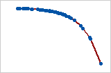

```{r,setup, include=FALSE, message=FALSE, warning=FALSE}
knitr::opts_chunk$set(cache=TRUE)
options(scipen = 999)
```


# Análise de Correlação


## Análise e Coeficiente de Correlação
\metroset{block=fill}

\begin{block}{Objetivo}	
A Análise de Correlação mede, \textbf{principalmente}, a força da relação linear
entre variáveis numéricas. A medida baseia-se no coeficiente de correlação
entre duas variáveis aleatórias.

- Covariância

$$
\begin{aligned}	
Cov(X,Y) &= E[(X - \mu_X)(Y - \mu_Y)], \\
         &= E[XY] - \mu_X \mu_Y
\end{aligned}
$$
- Correlação

$$
Cor(X,Y) = \rho_{xy} = \frac{Cov(X,Y)}{\sigma_X \sigma_Y} \,\, (-1 \leq \rho_{xy} \leq +1)
$$
\end{block}	


## Coeficientes de Correlação: Estimadores

\metroset{block=fill}

\begin{block}{Coeficiente de Correlação de Pearson}	
\begin{equation*}
r  = \frac{\sum_{i=1}^{n} (x_i - \bar{x}) (y_i - \bar{y})}{\sqrt{\sum_{i=1}^{n} (x_i - \bar{x})^2} \sqrt{\sum_{i=1}^{n} (y_i - \bar{y})^2}  }
\end{equation*}	
Sendo $x_i$ e $y_i$ os dados ou observações. \pause \textbf{Pressuposto:} 
Distribuição aproximandamente normal. \pause Sensível a valores extremos.	
\end{block}	

\pause
\begin{block}{Coeficiente de Correlação de Spearman}	
\begin{equation*}
r_s  = 1 - \frac{6\sum_{i=1}^{n} (x_i - y_i)^2}{n(n^2 - 1)}
\end{equation*}	
Sendo $x_i$ e $y_i$ os postos (\textit{rank}) das observações. \pause 
\textbf{Método não paramétrico:} robusto a outliers. menor 
poder do teste.
\end{block}


## Coeficientes de Correlação: Estimadores

\metroset{block=fill}

\begin{block}{Coeficiente de Correlação de Kendall}	
\begin{equation*}
r_k  = \frac{1}{n(n-1))} \sum_{i=1}^{n} \sum_{j=1}^{n} sgn(x_j - x_i) sgn(y_j - y_i)
\end{equation*}	
O coeficiente de correlação de Kendall usa pares de observações e determina a 
força da associação com base no padrão de concordância e discordância entre os pares. Duas VAs $X$ e $Y$ são concordantes se $X_2 - X_1 > 0$ e $Y_2 - Y_1 > 0$, 
ou $X_2 - X_1 < 0$ e $Y_2 - Y_1 < 0$.

\pause 
\textbf{Método não paramétrico:} robusto a outliers. menor 
poder do teste.
\end{block}


## Relações Monotônicas

\begin{alertblock}{Importante!}
Algumas relações monotônicas podem ser capturadas pelo coeficiente de 
correlação de Spearman (e de Kendall).
\end{alertblock}

```{r cubica, out.width = "30%", echo = FALSE, fig.align='center'}

```

```{r negativa, out.width = "30%", echo = FALSE, fig.align='center'}

```


## Níveis de Correlação: Interpretação

\centering
\begin{tabular}{|c|c|}
	\hline 
	\hline
  $\mathbf{r}$ 	                & \textbf{Magnitude}              \\ 
	\hline 
$ r \geq 0.5$     	            & correlação forte/alta           \\ 
	\hline
$0.3 \leq r \leq 0.5$ 	        & correlação moderada             \\
	\hline
$0.1 \leq r \leq 0.3$           & correlação fraca/pequena        \\ 
	\hline 
$r < 0.1$  	                    & correlação muito fraca/pequena  \\ 
	\hline 
	\hline
\end{tabular} 

\begin{flushleft}
COHEN, Jacob. \textbf{Statistical power analysis for the behavioral sciences}. 
Routledge, 1988.
\end{flushleft}


## Níveis de Correlação: Interpretação

\centering
\begin{tabular}{|c|c|}
	\hline 
	\hline
  $\mathbf{r}$ 	                & \textbf{Magnitude}                     \\ 
$r \geq 0.4$                    & muito forte/alta                       \\
  \hline 
$0.3 \leq r < 0.4$              & forte/alta                             \\
	\hline 
$0.2 \leq r < 0.3$     	        & moderada/média                         \\ 
	\hline
$0.1 \leq r < 0.2$ 	            & pequena                                \\
	\hline
$0.05 \leq r < 0.1$             & correlação muito fraca/pequena         \\ 
	\hline 
$r < 0.05$  	                  & correlação extremamente fraca/pequena  \\ 
	\hline 
	\hline
\end{tabular} 

\begin{flushleft}
FUNDER, David C.; OZER, Daniel J. Evaluating effect size in psychological research: Sense and nonsense. \textbf{Advances in Methods and Practices in Psychological Science}, v. 2, n. 2, p. 156-168, 2019.
\end{flushleft}


## Níveis de Correlação: Pacote effectsize

\metroset{block=fill}

\begin{block}{Pacote \texttt{effectsize}}

Vale a pena conhecer o pacote \href{https://easystats.github.io/effectsize/index.html}{effectize}. Veja como 
implementar as possibilidades de "regras de bolso" para a interpretação de estimativas de $r$ em \href{https://easystats.github.io/effectsize/articles/interpret.html}{Automated Interpretation of Indices of Effect Size}

\end{block}


## Cuidado! Quarteto de Anscombe

```{r fig02, out.width = "60%", echo = FALSE, fig.align='center'}

```

[Leia Wikipedia](https://en.wikipedia.org/wiki/Anscombe%27s_quartet)

\begin{alertblock}{Cuidado!}
uma medida estatística que sumariza a informação dos dados, não pode 
substituir o exame visual dos dados.
\end{alertblock}


## Inferência Estatística

\metroset{block=fill}

\begin{block}{Definição}
Inferência estatística é o processo que consistem em usar dados de 
uma amostra para tirar conclusões sobre parâmetros de uma população subjacente 
da qual a amostra (aleatória) foi retirada.
\end{block}

\begin{block}{Procedimentos Frequentistas de Inferência Estatística}
\begin{itemize}
\item Intervalos de Confiança
\item Testes de Hipóteses
\end{itemize}
\end{block}


## Inferência Estatística: Intervalos de Confiança

\metroset{block=fill}

\begin{block}{Intervalos de Confiança - Abordagem Frequentista}

\begin{itemize}
\item Um intervalo de confiança é um \textbf{intervalo} construído em torno de 
um \text{estimador} que tem um determinada \textbf{probabilidade (confiança)} de 
conter o verdadeiro valor do \textbf{parâmetro correspondente da população} de 
interesse.

\item Um intervalo com 95\% de confiança, por exemplo, implica que, se o 
processo de estimação fosse repetido várias vezes, espera-se que 95\% dos 
intervalos calculados contenham o valor verdadeiro do parâmetro.
\end{itemize}

\end{block}


## Inferência Estatística: Intervalos de Confiança

Para construir um intervalo de confiança que contenha o valor verdadeiro 
do parâmetro populacional $\theta$ com uma dada probabilidade/confiança, uma 
equação da seguinte forma deve ser resolvida:

$$
P(L_i \leq \theta \leq L_S) = ( 1-\alpha)*100\%
$$
sendo: 

\begin{itemize}
\item $\theta$ o parâmetro a ser estimado 
\item $L_i$ o limite inferior do intervalo
\item $L_s$ o limite superior do intervalo
\item $\alpha$ a probabilidade do intervalo não conter $\theta$
\item $(1 - \alpha)$ é o nível de confiança da estimativa do intervalo 
      conter $\theta$.
\end{itemize}


## Intervalos de Confiança

```{r ic, out.width = "70%", echo = FALSE, fig.align='center'}
knitr::include_graphics("img/ic.jpg")
```


## Inferência Estatística: Teste Estatístico de Hipóteses

\metroset{block=fill}

\begin{block}{Teste de Hipóteses - Abordagem Frequentista}

Um teste estatístico de hipóteses é um procedimento que nos permite, com base 
em certas regras de decisão, confirmar uma hipótese inicial de trabalho, 
chamada de \textbf{hipótese nula}, ou rejeitar esta hipótese nula em favor de 
uma \textbf{hipótese alternativa}.

\end{block}


## Inferência Estatística: Teste de Hipóteses

\begin{small}
Um teste estatístico de hipóteses baseado em uma amostra e geralmente envolve 
os seguintes passos:

\begin{enumerate}

\item Formular as hipóteses sobre os parâmetros populacionais:

\begin{itemize}
\item A hipótese nula $H_0$,
\item A hipótese alternativa $H_1$.
\end{itemize}

\item Determinar o \textbf{nível de significância} $\alpha$ do teste.

\item Determine a distribuição de probabilidade que corresponde à distribuição 
amostral da estatística de teste.

\item Calcular o valor crítico sob a hipótese nula e definir as regiões de 
rejeição e de aceitação.

\item Estabelecer as regras de decisão:

\begin{itemize}
\item Se a estatística de teste observada na amostra está localizada na 
região de aceitação, não rejeitamos a hipótese nula $H_0$;

\item Se a estatística de teste observada na amostra está localizada na 
região de rejeição, rejeitamos a hipótese nula H0 em favor da hipótese 
alternativa $H_1$.

\item Tomar a decisão de aceitar ou rejeitar a hipótese nula com base na
amostra observada.
\end{itemize}

\end{enumerate}

\end{small}


## Inferência Estatística: Erros Tipo I ($\alpha$), Tipo II ($\beta$) e Poder do Teste.

```{r erros, out.width = "100%", echo = FALSE, fig.align='center'}
knitr::include_graphics("img/erros.png")
```


## Poder do Teste e Tamanho da Amostra para $r$

```{r, eval=FALSE}
# Pacote pwr
library(pwr)

# funcao que estima o poder do teste ou determine os parametros para obter o poder 
# desejado
pwr.r.test(n = NULL, r = NULL, sig.level = 0.05, power = NULL,
           alternative = c("two.sided", "less","greater"))
```

sendo: 

\begin{itemize}
\item \texttt{n =} tamanho da amosta

\item \texttt{r =} tamanho do efeito - Cohen (1988):

  \begin{itemize}
  \item r = 0.1 (fraca)
  
  \item r = 0.3 (moderada)
  
  \item r = 0.5 (forte)
  \end{itemize}

\item \texttt{sig.level =} nível de significância = erro tipo I = $\alpha$

\item \texttt{power =} ($1 - \beta$) = poder do teste. (0.8 ou 80\% é um 
poder adequado em geral).
\end{itemize}


## Inferência Estatística: Teste de Hipóteses

```{r regiao, out.width = "100%", echo = FALSE, fig.align='center'}
knitr::include_graphics("img/ht.jpg")
```


## valor-p

\metroset{block=fill}

\begin{block}{Conceito}
\begin{itemize}
\item Em qualquer amostra, por exemplo, a média amostral $\bar{x}$ raramente 
será exatamente igual ao valor sob a hipótese nula ($H_0: \mu = \mu_0$, 
por exemplo). As diferenças entre $\bar{x}$ e $\mu_0$ podem surgir porque a 
média verdadeira (populacional) ($\mu$), de fato, não é igual a $\mu_0$ (a 
hipótese nula é falsa) ou porque a média verdadeira é igual $\mu_0$ (a hipótese 
nula é verdadeira), mas $\bar{x}$ difere de $\mu$ devido à amostragem aleatória.

\item É impossível distinguir entre essas duas possibilidades com certeza. 
Embora uma amostra de dados não possa fornecer evidências conclusivas sobre a hipótese nula, é possível fazer um \textbf{cálculo probabilístico} que permite 
testar a hipótese nula de forma que leva-se em conta a incerteza da amostragem.

\item Esse cálculo envolve o uso dos dados amostrais para calcular o 
\textbf{valor-p} da hipótese nula.
\end{itemize}
\end{block}


## Inferência Estatística: Teste de Hipóteses usando valor-p

\metroset{block=fill}

\begin{small}
\begin{block}{valor-p}

valor-P é a probabilidade, calculada assumindo-se que $H_0$ seja "verdadeira", 
de se obter um valor da estatística de teste igual ou superior à estatística 
de teste observada. Um valor-p muito pequeno significa que um resultado 
tão extremo quanto o observado seria muito improvável sob a hipótese nula.

$$
valor-p = P(|T| \geq |t| |H_0)
$$
```{r pvalue, out.width = "50%", echo = FALSE, fig.align='center'}
knitr::include_graphics("img/pvalue.png")
```

\href{https://en.wikipedia.org/wiki/P-value}{Verbete na wikipedia}

\end{block}
\end{small}


## Correlação: Inferência Estatística - Teste de Hipóteses

\metroset{block=fill}

\begin{block}{Teste para $r$ - Pearson}
\begin{align*}
H_0:\,\, & \rho = 0    \\
H_1:\,\, & \rho \neq 0	\\
t    & = \frac{r \sqrt{n - 2}}{\sqrt{1 - r^2}}  \sim t_{(n-2,\alpha)}
\end{align*}	

Usando um software estatístico, é fácil calcular a probabilidade de observar 
um valor igual o maior que $|t|$. Essa probabilidade recebe o nome de 
\textbf{valor-p}.

\begin{description}
\item[Se valor-p $<$ 0.05] A estimativa \textbf{é} estatisticamente diferente 
     de zero.

\item[Se valor-p $>$ 0.05] A estimativa \textbf{não é} estatisticamente 
     diferente de zero.
\end{description}

\textbf{Melhor}: Intervalo de Confiança para $\rho$
\end{block}


## Correlação: Inferência - Intervalo de Confiança

\metroset{block=fill}

\begin{block}{IC para $r$ - Pearson}
1. Aplica-se a transformada $Z$ de Fisher a $r$

\begin{equation*}
z = \ln \Bigl(\frac{1 + r}{1 - r}\Bigr)
\end{equation*}

2. Estima-se o IC com o valor $z$ com:

\begin{align*}
IC &= [z - z_{crítico}*ep; z + z_{crítico}*ep], \\
ep &= \frac{1}{\sqrt{n-3}}
\end{align*}

3. Converte-se a estimativa baseada em $z$ para valores $r$

\begin{equation*}
z = \frac{e^{2z} - 1}{e^{2z} + 1} = \tanh(z)
\end{equation*}

\end{block}
 


## Análise de Correlação: Sumário

\begin{itemize}[<+-| alert@+>]

\item Se as variáveis aleatórias forem numéricas, contínuas e normalmente     
      distribuídas, use o coeficiente de Pearson
	
\item Se as variáveis forem medidas usando uma escala ordinal ou tiverem      
      distribuições assimétricas e/ou outliers (i.e, não normalidade), e 
      determinados tipos de relações não lineares, utilize o coeficiente de 
      Spearman.
	
\item Relações identificadas utilizando coeficientes de correlação devem ser        
      interpretadas por aquilo que são: \textbf{associações}, 
      \alert{\textbf{não como relações de causa e efeito}}. Sob determinadas 
      condições, que precisam ser verificadas, é possível inferir relações de    
      causalidade.

\item Não é apropriado concluir que mudanças em uma variável \textbf{causam} 
      mudanças em outra com base apenas na correlação. 
	
\end{itemize}


## Análise de Correlação: Sumário

\begin{itemize}[<+-| alert@+>]

\item O coeficiente de correlação de Pearson é muito sensível a valores 
      extremos. Um único valor que é muito diferente dos outros valores em um 
      conjunto de dados pode alterar muito o valor do coeficiente. Você deve 
      tentar identificar a causa de qualquer valor extremo. Corrija qualquer 
      entrada de dados ou erros de medição. Considere a remoção de valores de 
      dados associados a eventos anormais e únicos (causas especiais). 
      Em seguida, repita a análise.
      
\item Um baixo coeficiente de correlação de Pearson não significa que não 
       exista relação entre as variáveis. As variáveis podem ter uma relação 
       não linear. Para verificar relações não lineares graficamente, crie 
       um gráfico de dispersão ou use regressão simples.
	
\item Use o coeficiente de correlação de Spearman para examinar a força e a 
      direção da relação monotônica entre duas variáveis contínuas ou ordinais. 
      Em uma relação monotônica, as variáveis tendem a se mover na mesma 
      direção relativa, mas não necessariamente a uma taxa constante.
\end{itemize}


## Correlações Espúrias

\begin{itemize}

\item É necessário muito cuidado com \textbf{correlações espúrias}!:

  \begin{itemize}
  
  \item Leitura: \href{https://hbr.org/2021/11/leaders-stop-confusing-correlation-with-causation}{Leaders: Stop Confusing Correlation with Causation}
  
  \item Leitura: \href{https://openeducationalberta.ca/saitintropsychology/chapter/correlation-vs-causation/}{Correlation vs. Causation}
  
  \item Leitura: \href{https://fabiandablander.com/r/Causal-Inference.html}{An introduction to Causal inference}
  
  \item Leitura: \href{https://risk.edhec.edu/sites/risk/files/1328885974025.pdf}{Correlation vs. Trends: A Common Misinterpretation}
  
  \item Site: \href{http://tylervigen.com/spurious-correlations}{Spurious Correlation}
  
  \end{itemize} 

\end{itemize}


## Reportando uma análise de correlação

\metroset{block=fill}

\begin{block}{Modelo American Psychological Association (APA)}
Um coeficiente de correlação de Pearson foi estimado para avaliar a relação 
linear entre [\textbf{variável 1}] e [\textbf{variável 2}].
 
Houve uma correlação [\textbf{negativa ou positiva}] [\textbf{significativa ou não 
significativa}], entre a \textbf{variável 1} e a \textbf{variável 2}, $t =$ valor caculado, p = [$valor-p$ do teste], $r$(\textbf{graus de liberdade}) = [estimativa de $r$], $n =$ tamanho da amostra. IC (95\%) [\textbf{inferior, superior}].
\end{block}

\begin{block}{Exemplo Hipotético}
Um coeficiente de correlação de Pearson foi estimado para avaliar a relação 
linear entre $X$  e $Y$.

Os resultados indicam uma correlação positiva significativa entre $X$ 
e $Y$: $t = 8.01$, $valor-p = .002$, $r(149) = .55$, $n = 151$, 
IC 95\% $[0.43, 0.65]$.
\end{block}


## Tutorial: Correlação

\metroset{block=fill}

\begin{small}
\begin{block}{Questões}	
\begin{enumerate}
  \item Usando o pacote `BatchGetSymbols` importe dados dos últimos 
        1000 dias para as seguintes ações: `AAPL`, `WEGE3.SA`, `AMZN`, 
        `GOOG`.
  \item Converta os dados diários dos preços de fechamento das ações para o 
        formato `xts`, usando o pacote `xts`, este é um formato específico 
        para o armazenamento de séries temporais em R. Além disso, elabore 
        gráficos das séries temporais de preços para cada uma das ações.
  \item Calcule os retornos compostos continuamente a partir dos preços 
        no formato `xts` usando a função `Return.calculate` do pacote 
        `PerformanceAnalytics`, elabore gráficos das séries temporais dos 
        retornos para cada uma das ações.
  \item Faça a fusão da séries de retornos das ações em um único objeto usando 
        a função `merge.xts()` do pacote `xts` e nomeie o objeto como 
        `retornos`.
  \item Faça uma análise gráfica da correlação entre os retornos das ações 
        usando a função `chart.Correlation()` do pacote `PerformanceAnalytics` 
        aplicada sobre o objeto `retornos`.
\end{enumerate}
\end{block}
\end{small}


## Tutorial: Correlação

\metroset{block=fill}

\begin{small}
\begin{block}{Questões}	
\begin{enumerate}
	\item[6.] Encontre a matriz de correlações de Pearson entre os retornos.
	\item[7.] Obtenha estimativas pontuais do $r$  de Pearson entre os retornos das 
	          ações e teste a hipótese nula de que $r = 0$.
	\item[8.] Dadas as regularidades empíricas dos retornos de açoes, qual 
	          estimador de $\rho$, você considera mais apropriado para verificar 
	          quais séries de retornos possuem correlações estatisticamente
	          significativas? Reporte os resultados do estimador escolhido, 
	          conforme o padrão da APA.
\end{enumerate} 
\end{block}
\end{small}


# Referências

\begin{thebibliography}{9}

\bibitem[Stock \& Watson (2004)]{sw}
{STOCK, James H.; Watson, Mark W. Econometria: uma abordagem moderna. 
Pearson Universidades, 2004. Capítulo 3. Disponível na Biblioteca Virtual 
Pearson: \url{https://plataforma.bvirtual.com.br/Account/Login}}

\bibitem[Wooldridge (2006)]{wol}
{WOOLDRIDGE, Jeffrey M. Introdução à econometria: uma abordagem moderna. 
São Paulo: Thomson, 2006. Disponível na Biblioteca do Campus}

\end{thebibliography}


