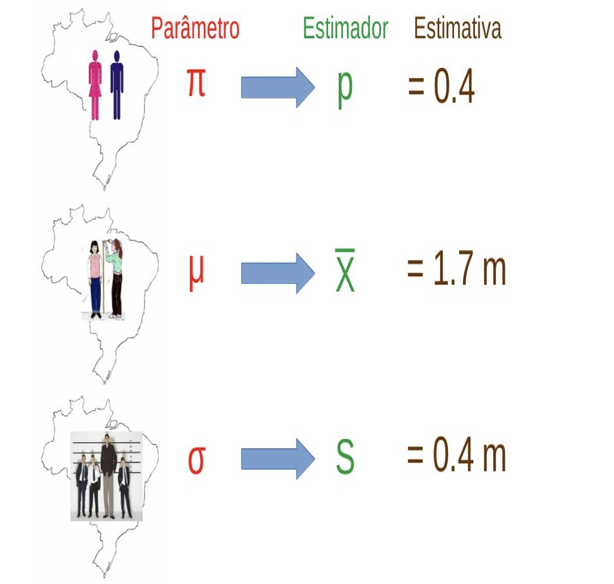

```{r,setup, include=FALSE, message=FALSE, warning=FALSE}
knitr::opts_chunk$set(cache=TRUE)
options(scipen = 999)
```


# Fundamentos de Inferência Estatística

## Inferência Estatística

\metroset{block=fill}

\begin{block}{Definição}
Inferência estatística é o processo que consiste em usar dados de 
uma amostra para tirar conclusões sobre carqcterísticas (parâmetros) de uma população subjacente da qual a amostra (aleatória) foi retirada.
\end{block}

```{r, out.width = "60%", echo = FALSE, fig.align='center'}
knitr::include_graphics("img/infer.jpeg")
```


## Inferência Estatística

\metroset{block=fill}

\begin{block}{Conceitos}

\begin{itemize}
\item \textbf{população}: conjunto de itens ou eventos com pelo menos uma característica em comum.
\item \textbf{parâmetro}: Uma característica da população
\item \textbf{amostra}: é um subconjunto da população
\item \textbf{estatística}: é qualquer função dos dados da amostra
\end{itemize}
\end{block}


## Inferência Estatística

\metroset{block=fill}

\begin{block}{Procedimentos de Inferência Estatística}
\begin{itemize}
\item \textbf{Estimação}: Pontual e Intervalos de Confiança
\item \textbf{Testes de Hipóteses}
\end{itemize}
\end{block}


## Estimação 

\metroset{block=fill}

\begin{itemize}
	\item \textbf{parâmetro}: característica da população.
	\item \textbf{estimador}: função (matemática) da amostra (estatística). 
	\item \textbf{estimativa}: valor realizado de um estimador.
\end{itemize}

```{r, out.width = "60%", echo = FALSE, fig.align='center'}

```


## Estimação 

\metroset{block=fill}

\begin{block}{Estimação}
O objetivo dos métodos de \textbf{Estimatição} é determinar o valor de um parâmetro populacional com base em uma estatística.

\begin{itemize}
	\item \textbf{Estimativa pontual}: estimativa singular (única).
	
	\item \textbf{Estimativa por Intervalo de Confiança}: intervalo de valores 
plausíveis para o parâmetro populacional.
\end{itemize}
\end{block}


## Estimação 

\metroset{block=fill}

\begin{block}{Métodos de Estimação}	
\begin{itemize}
	\item Método dos Momentos
	\item \textbf{Método da Máxima Verossimilhança}
	\item Método dos Mínimos Quadrados Ordinários
	\item Métodos Bayesianos
\end{itemize}
\end{block}


## Propriedades Desejáveis de Estimadores 

\metroset{block=fill}

\begin{block}{Propriedades}	

\textbf{Estimador Não Viesado}: 

$$
E(\hat{\theta}) = \theta \rightarrow E(\hat{\theta}) - \theta = 0
$$

\textbf{Estimador Eficiente}:

Dizemos que um estimador $\hat{\theta}$ é eficiente, se para um determinado 
tamanho de amostra $n$, a $V(\hat{\theta})$ é menor que a variância de 
qualquer outro estimador não viesado.


\textbf{Estimador Consistente}:

$\hat{\theta}$ é um estimador consistente de $\theta$, se na medida em 
que o tamanho da amostra aumenta, $\hat{\theta} \rightarrow \theta$ 

\end{block}


## Estimação Pontual: Máxima Verossimilhança

\metroset{block=fill}

\begin{block}{Estimação por Máxima Verossimilhança}	

\begin{itemize}[<+-| alert@+>]
	\item Em estatística, a estimação por máxima verossimilhança é um método de \textbf{estimar} os parâmetros de uma \textbf{distribuição de probabilidade} assumida, dadas as observações. 
	
	\item A estimativa é obtida \textbf{maximizando} uma função de verossimilhança para que, sob o modelo estatístico assumido, os dados observados sejam 
mais prováveis.
	
	\item O ponto no espaço de parâmetros que maximiza a função de verossimilhança é chamado de \textbf{estimativa de máxima verossimilhança}.
\end{itemize}

\end{block}


## Estimação Pontual: Máxima Verossimilhança

\metroset{block=fill}

\begin{itemize}
\item Modelamos um conjunto de observações como uma \textbf{amostra aleatória} 
a partir de uma \textbf{distribuição de probabilidade conjunta} 
desconhecida que é expressa em termos de um conjunto de \textbf{parâmetros}. 
	
\item O objetivo da estimativa de máxima verossimilhança é determinar os parâmetros para os quais os dados observados têm a maior probabilidade 
conjunta.

\item Avaliando a funcão de densidade conjunta na amostra de dados observada, 
$y = (y_1, y_2,\ldots, y_n)$, fornece uma função: 

$$
L_n(\theta;y) = f_n(y;\theta)
$$
denominada \textbf{função de verossimilhança}. 
\end{itemize}


## Estimação Pontual: Máxima Verossimilhança

\metroset{block=fill}

Para variáveis aleatórias independentes e identicamente distribuídas, $f_n(y;\theta)$ será o produto de funções de densidade univariadas:

$$
f_n(y;\theta) = \prod_{k = 1}^{n} f_{k}(y_k;\theta)
$$

Podemos simplificar o algoritmo, tomando o logaritmo natural:

$$
\ln(f_n(y;\theta)) = \sum_{k = 1}^{n} f_{k}(y_k;\theta)
$$
Essa é a \textbf{função de log-verossimilhança}, efetivamente utilizada nos 
algoritmos de estimação.


## Estimação Pontual: Máxima Verossimilhança

\metroset{block=fill}

O objetivo da estimativa de máxima verossimilhança é encontrar os valores dos parâmetros do modelo que maximizam a função de log-verossimilhança no espaço de parâmetros:

$$
\hat{\theta} = \max_{\theta \in \Theta} \ln(L_n(\theta;y)) 
$$

Intuitivamente, o método determina estimativas dos parâmetros que tornam mais 
prováveis os dados observados.


## Estimação Pontual: Máxima Verossimilhança

\metroset{block=fill}

Em uma amostra aleatória de dez relatórios financeiros produzidos pela controladoria de uma determinada empresa, verifica-se que o primeiro, terceiro 
e décimo relatórios possuem não conformidades graves, enquanto os outros não. 

$$
x <- c(1,0,1,0,0,0,0,0,0,1)
$$

Seja 

$$
p = P(\text{relatório não conforme})
$$
a proporção de relatórios que apresentam uma não conformidade, então a variável aleatória $X_i$ é definida por:

$$
X_i = 
\begin{cases}
1 & \text{se o relatório é não conforme} \\
0 & \text{se o relatório é conforme}
\end{cases}
$$


## Distribuição de Bernoulli

\metroset{block=fill}

Uma variável aleatória que segue uma distribuição de Bernoulli pode assumir apenas dois valores: 0 ("fracasso") ou 1 ("sucesso"), com probabilidades 
$p$ e $1-p$, respectivamente.

A função de probabilidade da distribuição de Bernoulli é dada por:

$$
  P(X = x) = 
  \begin{cases} p, & \text{se } x = 1 \\ 1-p, & \text{se } x = 0 \end{cases}
$$
que pode ser escrita como:

$$
f(x;p) = p^x (1 - p)^{1 -x}, \,\, y \in \{0,1\} 
$$

Desejamos um estimador de $p$ que maximize a probabilidade de ocorrência dos dados observados. 


## Estimação Pontual: Máxima Verossimilhança

\metroset{block=fill}

Como sabemos que $X$ pode ser modelada por uma distribuição de Bernoulli, a função de verossimilhança é dada por:

\begin{align*}
L_n(\theta;y) &= \prod_{k=1}^{10} p^{x_i} (1 - p)^{1 - x_{i}}, \\ 
\ln L_n(\theta;y)  &= \sum_{k = 1}^{n} x_i \ln(p) + \sum_{k = 1}^{n} (1 - x_{i}) 
\ln(1 - p), \\
                   &= n\bar{x}\ln(p) + (n - n\bar{x})\ln(1-p) \\
\frac{d}{dp} \ln L_n(\theta;y) &= \frac{n\bar{x}}{p} - \frac{n - n\bar{x}}{1-p} 
= 0, \\
\hat{p} &= \frac{\sum_{k = 1}^{n} x_i}{n} = \frac{3}{10} = 0.3
\end{align*}

Maximizar $\ln L_n(\theta;y)$ fornece estimativas de $p$ para as quais 
é mais provável que a amostra observada tenha sido gerada.


## Intervalos de Confiança

\metroset{block=fill}

\begin{block}{Intervalos de Confiança}

\begin{itemize}
\item Se você deseja estimar um parâmetro da população, prefere relatar um 
intervalo de valores em que o parâmetro possa estar ou um único valor?

\item Se relatarmos uma estimativa pontual, provavelmente não atingiremos o 
parâmetro exato da população.

\item Se relatarmos um intervalo de valores plausíveis, teremos uma boa chance 
de capturar o parâmetro.

\item Um intervalo de confiança é um intervalo de valores plausíveis para o 
parâmetro populacional.

\item Um intervalo com 95\% de confiança, por exemplo, implica que, se o 
processo de estimação fosse repetido várias vezes, espera-se que 95\% dos 
intervalos calculados contenham o valor verdadeiro do parâmetro.
\end{itemize}

\end{block}


## Intervalos de Confiança

\metroset{block=fill}

```{r ic, out.width = "70%", echo = FALSE, fig.align='center'}

```


## Intervalos de Confiança

\metroset{block=fill}

\begin{block}{Quantificando a incerteza}	
\begin{itemize}
\item Para construir um intervalo de confiança, precisamos quantificar a 
variabilidade do estimador utilizado.

\item Por exemplo, se desejamos construir um intervalo de confiança para uma 
proporção populacional ($p$), precisamos criar uma faixa plausível de valores 
em torno da estimativa da proporção ($\hat{p}$).

\item Esse intervalo dependerá de quão precisa é a estimativa da proporção.

\item Quantificar isso requer uma medição do quanto esperamos que estimativa da 
proporção varie de amostra para amostra
\end{itemize}
\end{block}


## Intervalos de Confiança: Quantificando a Incerteza

\metroset{block=fill}

\begin{block}{Métodos}	
Podemos quantificar a variabilidade de estimadores usando:

\begin{itemize}
\item Simulação de Monte Carlo: bootstrappo, ou por

\item Teoria: Teorema do Limite Central
\end{itemize}
\end{block}


## Quantificando a incerteza via Teoria

\metroset{block=fill}

\begin{block}{Teorema Central do Limite}	
Utilizando o Teorema Central do Limite, podemos demonstrar que, para grandes amostras, um estimador por intervalo com $(1 - \alpha)100\%$ de confiança, para 
uma proporção populacional é:

$$
\hat{p}-z_{\alpha/2}\sqrt{\dfrac{\hat{p}(1-\hat{p})}{n}} \leq p \leq \hat{p}+z_{\alpha/2}\sqrt{\dfrac{\hat{p}(1-\hat{p})}{n}}
$$
sendo:

$\alpha$ = nível de significância = a probabilidade do intervalo não conter 
$\theta$.

$(1 - \alpha)$ = é o nível de confiança da estimativa por intervalo.
\end{block}


## Quantificando a incerteza via Bootstrapp

\metroset{block=fill}

\begin{block}{}	

\begin{itemize}
\item Estimativas de parâmetros obtidas por bootstrapp não-paramétrico oferecem uma alternativa robusta aos métodos clássicos (paramétricos) para inferência estatística. 

\item Ao contrário dos métodos clássicos de inferência estatística que dependem de suposições paramétricas, ou seja, que os dados sigam uma distribuição de probabilidade, pelo menos aproximadamente, e/ou de aproximações assintóticas, 
isto é, a validade do estimador requer "grandes" amostras, o bootstrap não paramétrico usa métodos computacionalmente intensivos (Simulação de Monte Carlo) para fornecer resultados inferenciais válidos para diversas situações. 
\end{itemize}
\end{block}


## Quantificando a incerteza via Bootstrapp

\metroset{block=fill}

\begin{block}{Bootstrapp: Algoritmo}
\begin{enumerate}
\item Retire uma amostra aleatória com \textbf{reposição} da amostra original, 
do mesmo tamanho da amostra original.

\item Escolha um estimador de um parâmetro, calcule a estimativa (média, mediana, proporção, etc.) usando a amostra inicial.

\item Repita as etapas (1) e (2) muitas vezes para criar uma distribuição de 
bootstrap - uma distribuição de estatísticas de bootstrap.

\item Calcule os limites do intervalo com $(1-\alpha)100\%$ de confiança.
\end{enumerate}
\end{block}


## Quantificando a incerteza via Bootstrapp

\metroset{block=fill}

```{r, out.width = "100%", echo = FALSE, fig.align='center'}

```


## Testes Estatísticos de Hipóteses 

\metroset{block=fill}

\begin{block}{}	
\begin{itemize}
\item Nos EUA, as pessoas que desejam doar um órgão às vezes procuram a ajuda de um "consultor médico" especial. Esses consultores auxiliam o paciente em todos os aspectos da cirurgia, com o objetivo de reduzir a possibilidade de complicações durante o procedimento médico e a recuperação. 

\item Os pacientes podem escolher um consultor com base na taxa de complicações históricas dos clientes do consultor.

\item Uma consultora tentou atrair pacientes observando que a taxa média de complicações para cirurgias de doadores de fígado nos EUA é de cerca de 10%, 
mas seus clientes tiveram apenas 3 complicações nas 62 cirurgias nas quais 
atuou como consultora. 

\item Ela afirma que esses dados são uma forte evidência de que seu trabalho 
contribui significativamente para reduzir as complicações.
\end{itemize}
\end{block}


## Testes Estatísticos de Hipóteses  

\metroset{block=fill}

\begin{block}{Parâmetro em um Teste de Hipóteses}	

\begin{itemize}
\item Um \textbf{parâmetro} para um teste de hipótese é o valor populacional 
"verdadeiro" de interesse. 

\item Como vimos, estimamos um parâmetro usando uma \textbf{estimativa pontual}.
\end{itemize}

$p:$ = proporção verdadeira de complicações

$\hat{p}:$ = proporção amostral de complicações = $\frac{3}{62}$ = 
`r round(3/62, 3)`
\end{block}


## Testes Estatísticos de Hipóteses  

\metroset{block=fill}

\begin{block}{Correlação versus Causalidade}	

\begin{itemize}
\item É possível avaliar a afirmação causal da médica usando os dados?

\item Não. A alegação é que há uma conexão \textbf{causal}, mas os dados são observacionais.

\item Por exemplo, talvez os pacientes que podem pagar um consultor médica possam pagar melhores cuidados médicos, o que também pode levar a uma menor 
taxa de complicações.
\end{itemize}
\end{block}


## Testes Estatísticos de Hipóteses 

\metroset{block=fill}

\begin{block}{Duas reivindicações}	

\begin{itemize}

\item \textbf{Hipótese Nula}: "Não há nada acontecendo". A taxa de 
complicações para este consultor não é diferente da média dos EUA de 10%.

\item \textbf{Hipótese alternativa}: "Há algo acontecendo". A taxa de 
complicações para este consultor é \textbf{menor} do que a média dos EUA 
de 10%.

\end{itemize}

\end{block}


## Testes Estatísticos de Hipóteses 

\metroset{block=fill}

\begin{block}{Teste de hipóteses como um julgamento judicial}	

\begin{itemize}
\item hipótese Nula, $H_0$: O réu é inocente

\item \textbf{Hipótese alternativa}, $H_A$: O réu é culpado

\item \textbf{Apresente as evidências}: Coletam-se dados

\item \textbf{Julgue as evidências}: "Esses dados poderiam plausivelmente ter acontecido, \textbf{por acaso}, \textbf{se a hipótese nula fosse verdadeira?}"

\item Sim: Não rejeitar $H_0$

\item Não: Rejeitar $H_0$
\end{itemize}
\end{block}


## Testes Estatísticos de Hipóteses 

\metroset{block=fill}

\begin{block}{Estrutura de um teste de hipóteses}	

\begin{itemize}
\item Comece com uma hipótese nula, $H_0$, que representa o status quo.

\item Defina uma hipótese alternativa, $H_A$, que represente a questão da pesquisa, ou seja, o que estamos testando.

\item Realize um teste de hipótese sob a suposição de que a hipótese nula é verdadeira e calcule um \textbf{valor-p} (probabilidade de se obter um resultado 
igual ou mais extremo, dado que a hipótese nula é verdadeira).

\item se os resultados do teste sugerirem que os dados não fornecem evidências convincentes para a hipótese alternativa, não se rejeita a hipótese nula

\item caso contrário, rejeita-se a hipótese nula em favor da alternativa
\end{itemize}
\end{block}


## Teste Estatístico de Hipóteses

\metroset{block=fill}

\begin{block}{Estrutura Resumida}

\begin{itemize}

\item Defina as hipóteses.

\item Calcule a estatística de teste com base na amostra

\item Calcule o valor p.

\item Faça uma conclusão, sobre as hipóteses, no contexto dos dados e da 
questão da pesquisa.

\end{itemize}
\end{block}


## Testes Estatísticos de Hipóteses 

\metroset{block=fill}

\begin{block}{Erros em TH}	

\begin{itemize}
\item Erro Tipo 1: Rejeitar $H_0$ quando não deveria rejeitar $H_0$

\item $P(\text{Erro Tipo 1})$ = $\alpha$ = nível de significância do teste.

\item Erro Tipo 2: Não rejeitar $H_0$ quando você $H_0$ deveria ser rejeitada.

\item $P(\text{Erro Tipo 2})$ é mais difícil de calcular, e aumenta à medida que $\alpha$ diminui.
\end{itemize}
\end{block}

\begin{block}{Qual erro controlar?}	
Em um tribunal:

\begin{itemize}
\item Hipótese nula: O réu é inocente.

\item Hipótese alternativa: O réu é culpado.

\item O que é "pior": Erro Tipo 1 ou Tipo 2?
\end{itemize}
\end{block}


## Probabilidades de erros de teste

\metroset{block=fill}

\begin{block}{Probabilidades}
\begin{itemize}
\item $P(\text{Erro Tipo 1})$ = $\alpha$.

\item Poder = $P(\text{corretamente rejeitar a hipótese nula})$.

\item $P(\text{Erro Tipo 2})$ = 1 - Poder.
\end{itemize}
\end{block}


## Erros Tipo I ($\alpha$), Tipo II ($\beta$) e Poder do Teste.

```{r erros, out.width = "100%", echo = FALSE, fig.align='center'}

```


## Testes Estatísticos de Hipóteses 

```{r regiao, out.width = "100%", echo = FALSE, fig.align='center'}

```


## Poder do Teste e Tamanho da Amostra para $r$

```{r, eval=FALSE}
# Pacote pwr
library(pwr)

# funcao que estima o poder do teste ou determina os parâmetros 
# para obter o poder desejado
pwr.r.test(n = NULL, r = NULL, sig.level = 0.05, power = NULL,
           alternative = c("two.sided", "less","greater"))
```

sendo: 

\begin{itemize}
\item \texttt{n =} tamanho da amosta

\item \texttt{r =} tamanho do efeito - Cohen (1988):

  \begin{itemize}
  \item r = 0.1 (fraca)
  
  \item r = 0.3 (moderada)
  
  \item r = 0.5 (forte)
  \end{itemize}

\item \texttt{sig.level =} nível de significância = erro tipo I = $\alpha$

\item \texttt{power =} ($1 - \beta$) = poder do teste. (0.8 ou 80\% é um 
poder adequado em geral).
\end{itemize}


## valor-p

\metroset{block=fill}

\begin{block}{Conceito}
\begin{itemize}
\item Em qualquer amostra, por exemplo, a média amostral $\bar{x}$ raramente 
será exatamente igual ao valor sob a hipótese nula ($H_0: \mu = \mu_0$, 
por exemplo). As diferenças entre $\bar{x}$ e $\mu_0$ podem surgir porque a 
média verdadeira (populacional) ($\mu$), de fato, não é igual a $\mu_0$ (a 
hipótese nula é falsa) ou porque a média verdadeira é igual $\mu_0$ (a hipótese 
nula é verdadeira), mas $\bar{x}$ difere de $\mu$ devido à amostragem aleatória.

\item É impossível distinguir entre essas duas possibilidades com certeza. 
Embora uma amostra de dados não possa fornecer evidências conclusivas sobre a hipótese nula, é possível fazer um \textbf{cálculo probabilístico} que permite 
testar a hipótese nula de forma que leva-se em conta a incerteza da amostragem.

\item Esse cálculo envolve o uso dos dados amostrais para calcular o 
\textbf{valor-p} da hipótese nula.
\end{itemize}
\end{block}


## Testes de Hipóteses usando valor-p

\metroset{block=fill}

\begin{small}
\begin{block}{valor-p}

valor-P é a probabilidade, calculada assumindo-se que $H_0$ seja "verdadeira", 
de se obter um valor da estatística de teste igual ou superior à estatística 
de teste observada. Um valor-p muito pequeno significa que um resultado 
tão extremo quanto o observado seria muito improvável sob a hipótese nula.

$$
valor-p = P(|T| \geq |t| |H_0)
$$
```{r pvalue, out.width = "50%", echo = FALSE, fig.align='center'}

```

\href{https://en.wikipedia.org/wiki/P-value}{Verbete na wikipedia}

\end{block}
\end{small}


## O que você deseja fazer?

\metroset{block=fill}

\begin{block}{Procedimentos de Inferência Estatística}	
\begin{itemize}
\item \textbf{Estimação} -> Intervalo de Confiança

\item \textbf{Decisão} -> Teste de Hipóteses
\end{itemize}
\end{block}


# Análise de Correlação


## Análise e Coeficiente de Correlação
\metroset{block=fill}

\begin{block}{Objetivo}	
A Análise de Correlação mede, \textbf{principalmente}, a força da relação linear
entre variáveis numéricas. A medida baseia-se no coeficiente de correlação
entre duas variáveis aleatórias.

- Covariância

$$
\begin{aligned}	
Cov(X,Y) &= E[(X - \mu_X)(Y - \mu_Y)], \\
         &= E[XY] - \mu_X \mu_Y
\end{aligned}
$$
- Correlação

$$
Cor(X,Y) = \rho_{xy} = \frac{Cov(X,Y)}{\sigma_X \sigma_Y} \,\, (-1 \leq \rho_{xy} \leq +1)
$$
\end{block}	


## Coeficientes de Correlação: Estimadores

\metroset{block=fill}

\begin{block}{Coeficiente de Correlação de Pearson}	
\begin{equation*}
r  = \frac{\sum_{i=1}^{n} (x_i - \bar{x}) (y_i - \bar{y})}{\sqrt{\sum_{i=1}^{n} (x_i - \bar{x})^2} \sqrt{\sum_{i=1}^{n} (y_i - \bar{y})^2}  }
\end{equation*}	
Sendo $x_i$ e $y_i$ os dados ou observações. \pause \textbf{Pressuposto:} 
Distribuição aproximandamente normal. \pause Sensível a valores extremos.	
\end{block}	

\pause
\begin{block}{Coeficiente de Correlação de Spearman}	
\begin{equation*}
r_s  = 1 - \frac{6\sum_{i=1}^{n} (x_i - y_i)^2}{n(n^2 - 1)}
\end{equation*}	
Sendo $x_i$ e $y_i$ os postos (\textit{rank}) das observações. \pause 
\textbf{Método não paramétrico:} robusto a outliers. menor 
poder do teste.
\end{block}


## Coeficientes de Correlação: Estimadores

\metroset{block=fill}

\begin{block}{Coeficiente de Correlação de Kendall}	
\begin{equation*}
r_k  = \frac{1}{n(n-1))} \sum_{i=1}^{n} \sum_{j=1}^{n} sgn(x_j - x_i) sgn(y_j - y_i)
\end{equation*}	
O coeficiente de correlação de Kendall usa pares de observações e determina a 
força da associação com base no padrão de concordância e discordância entre os pares. Duas VAs $X$ e $Y$ são concordantes se $X_2 - X_1 > 0$ e $Y_2 - Y_1 > 0$, 
ou $X_2 - X_1 < 0$ e $Y_2 - Y_1 < 0$.

\pause 
\textbf{Método não paramétrico:} robusto a outliers. menor 
poder do teste.
\end{block}


## Relações Monotônicas

\begin{alertblock}{Importante!}
Algumas relações monotônicas podem ser capturadas pelo coeficiente de 
correlação de Spearman (e de Kendall).
\end{alertblock}

```{r cubica, out.width = "30%", echo = FALSE, fig.align='center'}
knitr::include_graphics("img/cubica.png")
```

```{r negativa, out.width = "30%", echo = FALSE, fig.align='center'}
knitr::include_graphics("img/negativa.png")
```


## Níveis de Correlação: Interpretação

\centering
\begin{tabular}{|c|c|}
	\hline 
	\hline
  $\mathbf{r}$ 	                & \textbf{Magnitude}              \\ 
	\hline 
$ r \geq 0.5$     	            & correlação forte/alta           \\ 
	\hline
$0.3 \leq r \leq 0.5$ 	        & correlação moderada             \\
	\hline
$0.1 \leq r \leq 0.3$           & correlação fraca/pequena        \\ 
	\hline 
$r < 0.1$  	                    & correlação muito fraca/pequena  \\ 
	\hline 
	\hline
\end{tabular} 

\begin{flushleft}
COHEN, Jacob. \textbf{Statistical power analysis for the behavioral sciences}. 
Routledge, 1988.
\end{flushleft}


## Níveis de Correlação: Interpretação

\centering
\begin{tabular}{|c|c|}
	\hline 
	\hline
  $\mathbf{r}$ 	                & \textbf{Magnitude}                     \\ 
$r \geq 0.4$                    & muito forte/alta                       \\
  \hline 
$0.3 \leq r < 0.4$              & forte/alta                             \\
	\hline 
$0.2 \leq r < 0.3$     	        & moderada/média                         \\ 
	\hline
$0.1 \leq r < 0.2$ 	            & pequena                                \\
	\hline
$0.05 \leq r < 0.1$             & correlação muito fraca/pequena         \\ 
	\hline 
$r < 0.05$  	                  & correlação extremamente fraca/pequena  \\ 
	\hline 
	\hline
\end{tabular} 

\begin{flushleft}
FUNDER, David C.; OZER, Daniel J. Evaluating effect size in psychological research: Sense and nonsense. \textbf{Advances in Methods and Practices in Psychological Science}, v. 2, n. 2, p. 156-168, 2019.
\end{flushleft}


## Níveis de Correlação: Pacote effectsize

\metroset{block=fill}

\begin{block}{Pacote \texttt{effectsize}}

Vale a pena conhecer o pacote \href{https://easystats.github.io/effectsize/index.html}{effectize}. Veja como 
implementar as possibilidades de "regras de bolso" para a interpretação de estimativas de $r$ em \href{https://easystats.github.io/effectsize/articles/interpret.html}{Automated Interpretation of Indices of Effect Size}

\end{block}


## Cuidado! Quarteto de Anscombe

```{r fig02, out.width = "60%", echo = FALSE, fig.align='center'}
knitr::include_graphics("img/fig02.png")
```

[Leia Wikipedia](https://en.wikipedia.org/wiki/Anscombe%27s_quartet)

\begin{alertblock}{Cuidado!}
uma medida estatística que sumariza a informação dos dados, não pode 
substituir o exame visual dos dados.
\end{alertblock}


## Correlação: Inferência Estatística - Teste de Hipóteses

\metroset{block=fill}

\begin{block}{Teste para $r$ - Pearson}
\begin{align*}
H_0:\,\, & \rho = 0    \\
H_1:\,\, & \rho \neq 0	\\
t    & = \frac{r \sqrt{n - 2}}{\sqrt{1 - r^2}}  \sim t_{(n-2,\alpha)}
\end{align*}	

Usando um software estatístico, é fácil calcular a probabilidade de observar 
um valor igual o maior que $|t|$. Essa probabilidade recebe o nome de 
\textbf{valor-p}.

\begin{description}
\item[Se valor-p $<$ 0.05] A estimativa \textbf{é} estatisticamente diferente 
     de zero.

\item[Se valor-p $>$ 0.05] A estimativa \textbf{não é} estatisticamente 
     diferente de zero.
\end{description}

\textbf{Melhor}: Intervalo de Confiança para $\rho$
\end{block}


## Correlação: Inferência - Intervalo de Confiança

\metroset{block=fill}

\begin{block}{IC para $r$ - Pearson}
1. Aplica-se a transformada $Z$ de Fisher a $r$

\begin{equation*}
z = \ln \Bigl(\frac{1 + r}{1 - r}\Bigr)
\end{equation*}

2. Estima-se o IC com o valor $z$ com:

\begin{align*}
IC &= [z - z_{crítico}*ep; z + z_{crítico}*ep], \\
ep &= \frac{1}{\sqrt{n-3}}
\end{align*}

3. Converte-se a estimativa baseada em $z$ para valores $r$

\begin{equation*}
z = \frac{e^{2z} - 1}{e^{2z} + 1} = \tanh(z)
\end{equation*}

\end{block}
 


## Análise de Correlação: Sumário

\begin{itemize}[<+-| alert@+>]

\item Se as variáveis aleatórias forem numéricas, contínuas e normalmente     
      distribuídas, use o coeficiente de Pearson
	
\item Se as variáveis forem medidas usando uma escala ordinal ou tiverem      
      distribuições assimétricas e/ou outliers (i.e, não normalidade), e 
      determinados tipos de relações não lineares, utilize o coeficiente de 
      Spearman.
	
\item Relações identificadas utilizando coeficientes de correlação devem ser        
      interpretadas por aquilo que são: \textbf{associações}, 
      \alert{\textbf{não como relações de causa e efeito}}. Sob determinadas 
      condições, que precisam ser verificadas, é possível inferir relações de    
      causalidade.

\item Não é apropriado concluir que mudanças em uma variável \textbf{causam} 
      mudanças em outra com base apenas na correlação. 
	
\end{itemize}


## Análise de Correlação: Sumário

\begin{itemize}[<+-| alert@+>]

\item O coeficiente de correlação de Pearson é muito sensível a valores 
      extremos. Um único valor que é muito diferente dos outros valores em um 
      conjunto de dados pode alterar muito o valor do coeficiente. Você deve 
      tentar identificar a causa de qualquer valor extremo. Corrija qualquer 
      entrada de dados ou erros de medição. Considere a remoção de valores de 
      dados associados a eventos anormais e únicos (causas especiais). 
      Em seguida, repita a análise.
      
\item Um baixo coeficiente de correlação de Pearson não significa que não 
       exista relação entre as variáveis. As variáveis podem ter uma relação 
       não linear. Para verificar relações não lineares graficamente, crie 
       um gráfico de dispersão ou use regressão simples.
	
\item Use o coeficiente de correlação de Spearman para examinar a força e a 
      direção da relação monotônica entre duas variáveis contínuas ou ordinais. 
      Em uma relação monotônica, as variáveis tendem a se mover na mesma 
      direção relativa, mas não necessariamente a uma taxa constante.
\end{itemize}


## Correlações Espúrias

\begin{itemize}

\item É necessário muito cuidado com \textbf{correlações espúrias}!:

  \begin{itemize}
  
  \item Leitura: \href{https://hbr.org/2021/11/leaders-stop-confusing-correlation-with-causation}{Leaders: Stop Confusing Correlation with Causation}
  
  \item Leitura: \href{https://openeducationalberta.ca/saitintropsychology/chapter/correlation-vs-causation/}{Correlation vs. Causation}
  
  \item Leitura: \href{https://fabiandablander.com/r/Causal-Inference.html}{An introduction to Causal inference}
  
  \item Leitura: \href{https://risk.edhec.edu/sites/risk/files/1328885974025.pdf}{Correlation vs. Trends: A Common Misinterpretation}
  
  \item Site: \href{http://tylervigen.com/spurious-correlations}{Spurious Correlation}
  
  \end{itemize} 

\end{itemize}


## Reportando uma análise de correlação

\metroset{block=fill}

\begin{block}{Modelo American Psychological Association (APA)}
Um coeficiente de correlação de Pearson foi estimado para avaliar a relação 
linear entre [\textbf{variável 1}] e [\textbf{variável 2}].
 
Houve uma correlação [\textbf{negativa ou positiva}] [\textbf{significativa ou não 
significativa}], entre a \textbf{variável 1} e a \textbf{variável 2}, $t =$ valor caculado, p = [$valor-p$ do teste], $r$(\textbf{graus de liberdade}) = [estimativa de $r$], $n =$ tamanho da amostra. IC (95\%) [\textbf{inferior, superior}].
\end{block}

\begin{block}{Exemplo Hipotético}
Um coeficiente de correlação de Pearson foi estimado para avaliar a relação 
linear entre $X$  e $Y$.

Os resultados indicam uma correlação positiva significativa entre $X$ 
e $Y$: $t = 8.01$, $valor-p = .002$, $r(149) = .55$, $n = 151$, 
IC 95\% $[0.43, 0.65]$.
\end{block}


## Tutorial: Correlação

\metroset{block=fill}

\begin{small}
\begin{block}{Questões}	
\begin{enumerate}
  \item Usando o pacote `BatchGetSymbols` importe dados dos últimos 
        1000 dias para as seguintes ações: `AAPL`, `WEGE3.SA`, `AMZN`, 
        `GOOG`.
  \item Converta os dados diários dos preços de fechamento das ações para o 
        formato `xts`, usando o pacote `xts`, este é um formato específico 
        para o armazenamento de séries temporais em R. Além disso, elabore 
        gráficos das séries temporais de preços para cada uma das ações.
  \item Calcule os retornos compostos continuamente a partir dos preços 
        no formato `xts` usando a função `Return.calculate` do pacote 
        `PerformanceAnalytics`, elabore gráficos das séries temporais dos 
        retornos para cada uma das ações.
  \item Faça a fusão da séries de retornos das ações em um único objeto usando 
        a função `merge.xts()` do pacote `xts` e nomeie o objeto como 
        `retornos`.
  \item Faça uma análise gráfica da correlação entre os retornos das ações 
        usando a função `chart.Correlation()` do pacote `PerformanceAnalytics` 
        aplicada sobre o objeto `retornos`.
\end{enumerate}
\end{block}
\end{small}


## Tutorial: Correlação

\metroset{block=fill}

\begin{small}
\begin{block}{Questões}	
\begin{enumerate}
	\item[6.] Encontre a matriz de correlações de Pearson entre os retornos.
	\item[7.] Obtenha estimativas pontuais do $r$  de Pearson entre os retornos das 
	          ações e teste a hipótese nula de que $r = 0$.
	\item[8.] Dadas as regularidades empíricas dos retornos de açoes, qual 
	          estimador de $\rho$, você considera mais apropriado para verificar 
	          quais séries de retornos possuem correlações estatisticamente
	          significativas? Reporte os resultados do estimador escolhido, 
	          conforme o padrão da APA.
\end{enumerate} 
\end{block}
\end{small}


# Referências

\begin{thebibliography}{9}

\bibitem[Stock \& Watson (2004)]{sw}
{STOCK, James H.; Watson, Mark W. Econometria: uma abordagem moderna. 
Pearson Universidades, 2004. Capítulo 3. Disponível na Biblioteca Virtual 
Pearson: \url{https://plataforma.bvirtual.com.br/Account/Login}}

\bibitem[Wooldridge (2006)]{wol}
{WOOLDRIDGE, Jeffrey M. Introdução à econometria: uma abordagem moderna. 
São Paulo: Thomson, 2006. Disponível na Biblioteca do Campus}

\end{thebibliography}


